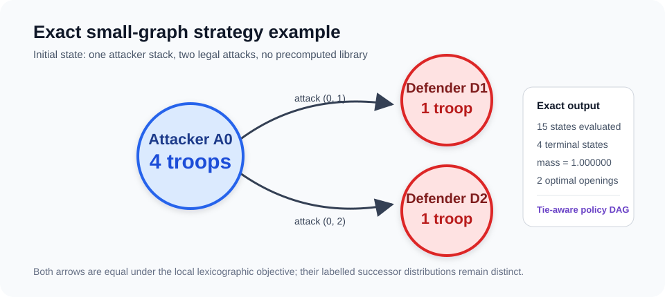
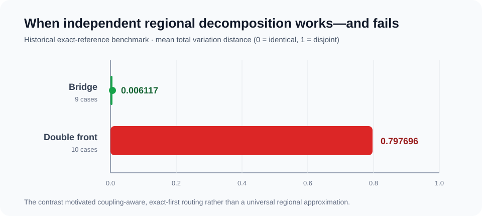

# Risk Strategy Optimization

> A multi-year computational modelling investigation into stochastic strategy
> optimization on graphs, using Risk combat as a controlled experimental
> environment. The public core combines an absorbing Markov combat model,
> finite-state dynamic programming, graph canonicalization, policy-aware joint
> successor distributions, and distribution-level validation.

The question is not simply “will this attack win?” It is: **which legal attack
sequence should be chosen when every battle is stochastic, each conquest changes
the graph of future actions, and downstream decisions depend on the complete
successor-state distribution?**

This repository demonstrates the strongest runnable exact core on small graphs.
It is a curated extract of a much larger research archive, not a complete Risk AI
and not a publication of the commercial board game.



## Run the exact example

```bash
python -m pip install -r requirements.txt
python examples/run_exact_example.py
```

The included three-node example starts with one attacker node holding four
troops and two adjacent defender nodes holding one troop each. The genuine
compact solver evaluates the finite state DAG and reports:

```text
Lexicographic value: (1.496647620, 2.878787620, 0.580098240)
Canonical optimal opening attack: (0, 1)
Exactly tied optimal opening attacks: 2
Terminal support: 4 states
Probability mass: 1.000000000000
```

The value components are expected newly conquered territories, expected final
attacker troops, and probability of complete local conquest, compared
lexicographically. The two symmetric opening attacks have equal value but
different labelled successor-state distributions (TV distance `0.718591140`),
so the policy representation keeps them separate.

## Current runnable model


The computation is exact with respect to the implemented finite rules and the
tabulated combat-transition kernel: every reachable strategic state and every
nonzero combat branch is propagated without Monte Carlo sampling. The original
kernel uses published transition probabilities rounded to three decimals; it is
therefore not a fresh rational enumeration of every dice outcome.

Why retain a distribution instead of only expected utility? Two policies can
have the same local objective value but leave troops on different nodes. Those
states create different borders, legal actions, and next-wave opportunities.
Collapsing them to one expectation discards information required by the next
decision.

## Why the problem is computationally interesting

- Combat transitions are stochastic and path-dependent.
- Every state can offer several legal attacks and post-conquest movement choices.
- Conquest changes node ownership and can open new attack edges.
- Shared subproblems make the search a finite DAG rather than a simple tree.
- State-space growth depends on topology, troop caps, and reachable—not merely
  combinatorially possible—states.
- Equally valued policies can induce different successor distributions.

This is a small stochastic-control and dynamic-programming problem with graph
structure. The public code deliberately focuses on a tractable, inspectable
case rather than claiming a solved general game-playing system.

## Validation drove the architecture

The table below reports saved results verified against the original research
reports. Only the small exact example and 13-test public suite are rerun from
this repository; the larger results are preserved historical evidence.

| Finding | Verified result | Interpretation |
|---|---:|---|
| Exact tractability pilot | 360/360 completed; worst `0.783527 s` | Full exact solving was practical across the tested 6–8-node, cap 3–5 cases. |
| Exact composition vs 10,000-sample MC | `0.000496 s` vs `4.008617 s`; MC TV `0.003499` | Once regional inputs are fixed, exact composition removes sampling cost and error. |
| Bridge decomposition | mean TV `0.006117` over 9 cases | Weak coupling can make regional composition highly accurate. |
| Double-front decomposition | mean TV `0.797696` over 10 cases | Sequence-dependent coupling can invalidate independent regions. |
| Exact candidate selection | changed 15/50 choices; all seven prior TV=1 cases remained TV=1 | Selection noise and decomposition error are separate problems. |
| Exact policy ties | 14 records with materially different tied distributions; max sampled TV `0.185074` | Equal objective value does not imply an interchangeable transition distribution. |



See [validation notes](docs/validation.md) and the retained compact reports in
[`validation/historical/`](validation/historical/) for evidence levels,
conditions, and caveats.

## Modelling development

The project evolved through a repeated cycle of hypothesis, implementation,
validation, limitation, and architectural change:

1. **Simulation and macro statistical modelling.** Regression, GLMs, and
   spline-based GAMs captured broad strategic relationships. One early linear
   fit reached approximately `R² = 0.952`, but aggregate state compression could
   not reconstruct legal future board states.
2. **Node-level machine learning.** Continent-specific Random Forest models
   produced capture ROC-AUC values of roughly `0.985–0.995` on a random row
   split. These metrics may be optimistic because related states were not
   separated by a grouped holdout, and independent node outputs did not define
   one legal joint successor state.
3. **Exact local modelling.** An absorbing combat model and memoized graph
   recursion provided a correctness-focused solver and full terminal
   distributions.
4. **Regional decomposition.** Exact local regions and two-stage candidate
   ranking scaled the experiments, but controlled comparisons exposed severe
   double-front and sequence-opening failures.
5. **Exact-first pivot.** Tractability experiments showed that more of the
   relevant space could be solved exactly than expected. The validated target
   became full exact first, coupled exact macro-regions second, independent
   composition only under weak coupling, and bounded approximation last.

The exact-first router is a **proposed, validation-supported target
architecture**. It is not presented here as one completed production pipeline.
The full histories are retained in
[`docs/MODEL_DEVELOPMENT_HISTORY.md`](docs/MODEL_DEVELOPMENT_HISTORY.md) and
[`docs/MODEL_DEVELOPMENT_HISTORY_2025-11_2025-12.md`](docs/MODEL_DEVELOPMENT_HISTORY_2025-11_2025-12.md).

## Implementation status

| Status | Included here |
|---|---|
| Implemented and runnable | Combat kernel, graph/state semantics, compact exact solver, exact policy DAG, distribution metrics, tiny example, tests. |
| Validated in the research archive | Regional error studies, exact tractability scans, exact composition benchmarks, candidate-selection experiments, policy-tie studies. |
| Proposed target | Unified tractability/coupling router and regenerated joint-distribution ML targets. |

## Repository guide

- `risk_strategy/` — faithful mathematical core plus a thin public demo wrapper.
- `examples/` — clean-checkout exact example; no precomputed library required.
- `tests/` — combat, solver, canonicalization, policy-DAG, and metric invariants.
- `validation/` — public validation runner and selected historical reports.
- `docs/` — architecture, validation interpretation, public-release review, and
  the two development histories.
- `PORTFOLIO_BUILD_MANIFEST.md` — source hashes, inclusion decisions, and
  post-copy change classifications.

## Limitations and scope

- This is not a complete implementation of the full commercial board game.
- Exact solving is demonstrated on small graphs and still scales
  combinatorially.
- The public subset does not include the production-like regional pipeline or
  multi-turn ML branches because they depend on broader research infrastructure
  and are not the final integrated architecture.
- Historical ML metrics use a split design that may overstate generalization.
- Large historical experiments are documented rather than regenerated here.
- The combat kernel inherits three-decimal transition probabilities from its
  source table; “exact” describes state enumeration and propagation under that
  kernel.
- A final software license has intentionally not been chosen.

## Data, artifacts, and rights

The public repository does not require or include approximately 19 GiB of
precomputed pickle libraries, full datasets, trained model binaries, third-party
PDFs, raw experimental output, caches, commercial board artwork, or personal
machine paths. The graph figures are original schematics.

Risk is referenced descriptively as an experimental environment. This project
is unofficial and is not affiliated with or endorsed by the owner of the Risk
game or its trademarks. No software license is granted until the author makes
that explicit manual choice.
