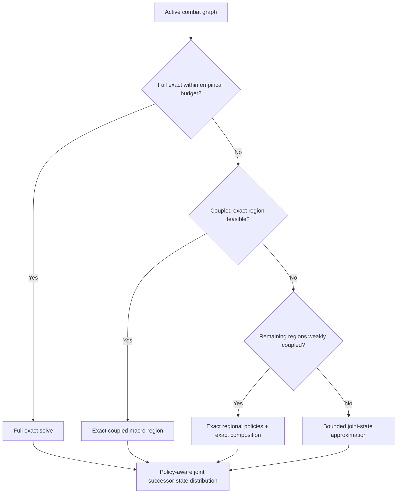

# Risk Strategy Optimization

> A multi-year computational modelling project exploring how strategies can be
> evaluated and optimized in a stochastic graph-based game.

Risk provides a useful experimental setting for a broader computational
question:

> **How should a decision-maker choose between stochastic action sequences when
> every outcome changes the state of the graph and therefore the decisions that
> become available next?**

A board position can be represented as a graph: territories are nodes, borders
are edges, ownership and troop counts define the state, and combat creates
stochastic transitions. A conquest can open a new front, close another, move
troops to a strategically different node, or make a previously impossible
action available.

The project developed around one recurring modelling problem:

> **How much of the full decision problem can be simplified, compressed or
> precomputed without discarding information needed by the next decision?**

The current direction is **exact-first**: preserve exact state transitions and
strategic coupling wherever computation permits, and introduce approximation
only beyond that boundary.

---

## Two related systems

The repository preserves two related but distinct architectures.

### Original explicit game simulator

The project includes an early mutable Risk simulation platform under
[`src/project_risk/game_simulation/`](src/project_risk/game_simulation/):

```text
SimulationEngine.py
    ├── orchestrates players from Players.py
    ├── invokes rules and actions from SimulationFunctions.py
    └── reads and mutates territory state defined in Board.py
```

- `Board.py` defines territories, topology, ownership and troop state.
- `Players.py` defines player state, ownership and early strategy hooks.
- `SimulationFunctions.py` implements rule and state-changing helpers for
  reinforcement, combat, movement and ownership changes.
- `SimulationEngine.py` coordinates setup, turn order, turn execution and
  repeated simulation runs.

This simulator is an important historical and reusable layer, but it is not the
turn engine used by the later mathematical `GlobalState` pipeline. No completed
adapter currently installs the advanced mathematical strategy as a player
policy in `SimulationEngine`.

### Mathematical strategy pipeline

The later modelling system is organized by the scale and responsibility of each
layer:

```text
strategic objectives and evaluation contract
        ↓
small_graph_model
        ↓
libraries
        ↓
continent_model
        ↓
transition_prediction_ml
        ↓
full_board_model
        ↓
strategic_evaluation
```

| Layer | Main responsibility | Current status |
|---|---|---|
| Strategic objectives | Separate transition prediction from outcome evaluation | Conceptual and implemented utility components |
| Small-graph model | Solve local tactical policies and successor distributions exactly | Mature core |
| Exact policy libraries | Precompute and retrieve reusable small-graph solutions | Mature infrastructure; production artifacts not distributed |
| Continent / large-graph model | Route between full exact, coupled exact and regional reasoning | Main research frontier |
| Transition prediction | Learn cheaper surrogates for expensive large-graph transitions | Historical RF and experimental joint-state/KNN routes |
| Full-board model | Chain transitions across resources, players and turns | Historical prototype and experimental particle direction |
| Strategic evaluation | Score terminal states and compare commitment profiles | Partially implemented |

The pipeline describes modelling responsibility rather than a claim that every
layer is already connected in one production runtime.

For the full conceptual account, see
[`docs/MODELLING_APPROACH.md`](docs/MODELLING_APPROACH.md). For module-level
design, see [`docs/architecture.md`](docs/architecture.md).

---

## Strategic objectives and model interfaces

Before a strategy can be optimized, optimality has to be defined.

Project Risk separates two tasks:

1. **Prediction:** given a state and a policy, which successor states may follow
   and with what probabilities?
2. **Evaluation:** given a possible outcome, how desirable is that outcome?

The lower modelling layers construct transition distributions at increasing
graph scales. The final evaluation layer uses those distributions to compare
higher-level strategic commitments, such as continent objectives.

This separation matters because a sophisticated utility function cannot repair
an incorrect transition model, while a correct transition model cannot choose
between policies without a preference rule.

---

## 1. Small-graph model

The small-graph model is the tactical core of the project. It combines
node-to-node combat with sequential policy optimization over a limited active
combat graph.

### Combat probabilities

`markov_matrix_probabilities.py` treats combat between two hostile territories
as a finite absorbing Markov chain. Instead of returning only the probability of
victory, it returns the complete distribution over terminal attacker and
defender troop configurations.

That distribution becomes the elementary stochastic transition kernel for the
graph solver.

### Sequential tactical policies

When several hostile edges are available, the player must choose which attack
to initiate, observe its stochastic outcome and then choose again from the new
state.

```text
current graph state
        ↓
choose a legal attack
        ↓
stochastic battle outcome
        ↓
new ownership and troop placement
        ↓
new legal actions
        ↓
choose again
```

`small_graph_outcome_probabilities.py` defines the principal state and policy
semantics. `exact_finite_solver.py` performs the more computationally efficient
finite-state solution using memoization and dynamic programming over the
reachable state DAG.

The local objective compares policies lexicographically using:

1. expected newly conquered territories;
2. expected final attacker troops; and
3. probability of complete local conquest.

The solver returns both an optimal value and a **joint probability distribution
over concrete terminal graph states**.

That distinction is essential. Two locally equal policies may leave surviving
troops on different nodes and therefore create different opportunities for the
next tactical problem. Later policy representations consequently preserve tied
root actions, downstream `state_set` alternatives and, for validation, fuller
exact policy DAGs.

### Troop-count scaling: from plateau to exact computation

The earliest practical scaling problem was high troop counts on otherwise small
graphs. The historical sequence was:

```text
inefficient explicit policy calculation
        ↓
plateau approximation above the tractable troop range
        ↓
plateau assumption proves too weak
        ↓
memoization and dynamic programming
        ↓
compact exact finite solver
        ↓
higher troop caps solved explicitly
```

The plateau approach predated the later dynamic-programming solution. Once
repeated successor states could be reused efficiently, extrapolation was no
longer necessary for the intended small-graph range.

This is separate from the large-graph scaling problem. Troop-count scaling on a
fixed small topology became primarily an exact-computation problem; scaling the
number of interacting nodes remains the responsibility of `continent_model`.

---

## 2. Exact policy libraries

Solving one small graph exactly is useful, but a larger simulation or transition
generator may encounter equivalent local structures repeatedly. Project Risk
therefore precomputes exact policies for supported small graphs and reuses them
through a library interface.

The library idea predates the current exact finite solver. Better solvers later
allowed the same architecture to cover higher troop caps, more topologies and
richer policy outputs.

### Offline generation

```text
graph topology
    ↓
role-preserving canonicalization
    ↓
supported troop configurations
    ↓
exact policy solution
    ↓
one or more tied policy alternatives
    ↓
joint terminal-state distributions
    ↓
indexed and chunked policy library
```

### Runtime lookup

```text
board or large-graph region
    ↓
normalize attacker and defender roles
    ↓
canonicalize the local graph
    ↓
identify the troop configuration
    ↓
query through library_io.py
    ↓
recover policy-specific distributions
    ↓
map canonical nodes back to the larger state
```

Canonicalization allows differently labelled but role-equivalent graphs to
share one exact solution. Later library formats use compact vectorized payloads,
graph-level indexes and chunked storage so that only the required rows need to
be loaded.

Restricted graph families, particularly star topologies, extend exact coverage
to otherwise awkward attacker/defender count combinations without pretending
that every topology of the same size has been solved.

The research archive contains millions of solved states and many gigabytes of
generated library artifacts. Those artifacts are documented but not distributed
in this public repository.

---

## 3. Continent / large-graph model

When the number of interacting nodes becomes too large for one supported exact
solution, the implemented production-like route uses exact small-graph policies
as regional building blocks.

### Regional policy evaluation

```text
large active battle graph
        ↓
generate supported regional partitions
        ↓
query exact policy libraries
        ↓
retain regional policy alternatives
        ↓
construct partition-policy candidates
        ↓
compare local utility
        ↓
evaluate downstream tactical consequences
```

A candidate may contain several regions, and each region may contain several
locally tied policies. Preserving policy identity matters because equally valued
regional policies can create different next-wave opportunities.

The second-wave model samples concrete regional successor states, reconstructs
the resulting large state, rebuilds the active battle graph and partitions it
again. Region boundaries are therefore not fixed across waves: nodes previously
placed in different regions may interact after a conquest opens a new front.

### Prefer the richest exact-supported region

The model prefers maximal supported partitions. A finer partition is treated as
dominated when a strict exact coarsening covers the same node universe with fewer
regions and every fine region is contained in a region of that coarser
partition.

This expresses the principle:

> **Preserve as much exact coupling as the available region representation
> permits before comparing approximate regional utilities.**

### Composition is not decomposition

Two questions have to be kept separate:

- **Composition:** how should known regional successor distributions be combined?
- **Decomposition:** was it valid to treat the regions as separate stochastic
  components in the first place?

Once regional distributions are known, exact Cartesian composition can be
cheaper and more accurate than Monte Carlo sampling of their product. Monte
Carlo remains useful for downstream look-ahead over concrete successor states
that are rebuilt and repartitioned.

Neither method validates the original decomposition. An exactly calculated
product distribution can still be wrong when actions in one region open, close
or redirect actions in another.

### Validation changed the routing assumption

| Experiment | Result | Modelling implication |
|---|---:|---|
| Exact tractability pilot | 360/360 cases completed; worst runtime `0.783527 s` | Exact solving was practical over a wider region than loose bounds suggested. |
| Exact composition vs 10,000-sample Monte Carlo | `0.000496 s` vs `4.008617 s`; MC TV error `0.003499` | Sampling a tractable product distribution can add cost and noise. |
| Weakly coupled bridge cases | mean TV `0.006117` | Regional decomposition can be highly accurate when coupling is weak. |
| Strongly coupled double-front cases | mean TV `0.797696` | Independent regions can lose essential sequence dependence. |
| Exact regional candidate selection | changed 15/50 selections, but all seven previous TV=1 failures remained | Better ranking cannot repair dependencies discarded by decomposition. |
| Exact tied-policy study | equal values produced materially different successor distributions | Equal utility does not make transition models interchangeable. |

See [`docs/validation.md`](docs/validation.md) for conditions, provenance and
caveats.

### Current large-graph hybrid direction

The resulting routing principle is:



The ordering is intentional:

**preserve exactness first, preserve coupling second, approximate only when
necessary.**

This is a validation-supported target architecture, not a claim that an
automatic router has already been integrated through the full multi-turn model.

---

## 4. Transition prediction and machine learning

The statistical and machine-learning work is a **surrogate-modelling branch of
the large-graph pipeline**.

The dependency is:

```text
initial large-graph state
        ↓
expensive partition / library / look-ahead model
        ↓
generated successor target
        ↓
statistical or machine-learning surrogate
```

The surrogate was intended to reproduce an expensive transition process cheaply
enough for repeated use. It was not an independent replacement for the combat,
graph or policy semantics below it.

### Macro statistical models

Regression, GLMs and GAMs used strategic descriptors such as troop and territory
balance, concentration, topology and reserve distance. These models captured
broad strategic outcomes well, but a compressed expectation could not reconstruct
the concrete legal successor state required for recursive simulation.

### Node-level Random Forest models

The next generation predicted ownership and troop outcomes for individual
nodes. Historical models achieved strong metrics relative to their generated
labels, including capture ROC-AUC values around 0.985--0.995.

The larger limitation was target validity. The labels inherited older local
objectives, plateau-based high-troop policies, unvalidated regional
decomposition and incomplete edge-case coverage. Row-level train/test splits
could also overstate generalization.

The correct interpretation is therefore that the Random Forests reproduced
their generated targets with high predictive performance while the validity of
those targets as optimal large-graph play remained uncertain.

### Joint successor-state prediction

Independent node marginals do not necessarily form one legal board. Later work
therefore shifted toward distributions over complete successor signatures and
an experimental retrieval/KNN-style model.

This preserves correlated ownership and troop outcomes because every node in a
signature comes from the same realized transition. The joint-state model should
nevertheless be retrained only after the large-graph hybrid target generator and
policy-tie semantics have been corrected and validated.

---

## 5. Full-board multi-turn model

A continent-scale transition describes primarily one active player's combat
process. A full-board turn also includes reinforcement allocation, troop
redistribution, fortification, competing continent objectives, shared frontiers
and alternating player perspectives.

The mathematical full-board layer under `full_board_model/` chains these
responsibilities around the transition model. It is distinct from the original
`SimulationEngine` architecture described earlier.

Two modelling generations are retained:

1. a historical RF-based rollout that demonstrated alternating-player and
   resource-allocation architecture but inherited the weaknesses of its
   transition targets; and
2. a later joint-state particle direction intended to propagate uncertainty as
   a bounded distribution over coherent boards.

The latest exact-first and coupling-aware conclusions from `continent_model`
have not yet been integrated end to end through this layer. The preferred order
is to validate the large-graph target generator, rebuild the learned transition
model and only then reconnect the full-board rollout.

---

## 6. Strategic evaluation

Strategic objectives frame the pipeline at the beginning; their concrete
evaluation modules consume its outputs at the end.

`utility_terminal.py` scores compatible terminal or horizon states independently
of whether they were produced by an exact solver, regional approximation,
learned transition or multi-turn rollout.

`game_theory_commitment.py` enumerates higher-level commitment profiles, invokes
compatible full-board rollouts and converts resulting states into payoff tables:

```text
commitment profile
        ↓
multi-turn rollout
        ↓
terminal state
        ↓
terminal utility
        ↓
payoff table
```

The term *game theory* is narrow in the current implementation. This layer
constructs and compares strategic payoff structures; it does not currently
solve for or select a Nash equilibrium.

---

## Research source and reproducible demo

The repository exposes two deliberately separate surfaces.

**Actual research source:** [`src/project_risk/`](src/project_risk/)

```text
game_simulation/
mathematical/
    small_graph_model/
    libraries/
    continent_model/
    transition_prediction_ml/
    full_board_model/
    strategic_evaluation/
infrastructure/
validation/
```

**Runnable example:** [`examples/run_exact_example.py`](examples/run_exact_example.py)

**Demo documentation:** [`demo/exact_demo/`](demo/exact_demo/)

**Optional presentation:** [`demo/visualization/`](demo/visualization/)

The example imports and exercises the authoritative `project_risk` source. It is
an orchestration layer, not a second mathematical implementation.

### Run the exact example

The self-contained example contains one attacker node with four troops and two
adjacent one-troop defender nodes.

```bash
python -m pip install -e .
python examples/run_exact_example.py
```

Expected output includes:

```text
Lexicographic value: (1.496647620, 2.878787620, 0.580098240)
Canonical optimal opening attack: (0, 1)
Exactly tied optimal opening attacks: 2
Terminal support: 4 states
Probability mass: 1.000000000000
```

The example demonstrates absorbing Markov combat transitions, exact finite-state
dynamic programming, graph semantics, optimal policy selection, tied policies
and joint terminal-state distributions.

It is a **reproducible window into the mathematical core**, not the complete
Project Risk model.

---

## Repository guide

- [`docs/MODELLING_APPROACH.md`](docs/MODELLING_APPROACH.md) — conceptual
  account organized by the current modelling pipeline.
- [`docs/architecture.md`](docs/architecture.md) — technical architecture of
  the same pipeline and the separate original simulator.
- [`docs/validation.md`](docs/validation.md) — validation results, evidence
  classes, conditions and caveats.
- [`docs/MODEL_DEVELOPMENT_HISTORY.md`](docs/MODEL_DEVELOPMENT_HISTORY.md) —
  chronological development history. Unlike the pipeline documents, it follows
  when components and modelling ideas were developed.
- [`src/project_risk/`](src/project_risk/) — reusable research source.
- [`examples/`](examples/) and [`demo/`](demo/) — runnable example and optional
  presentation material.
- [`tests/`](tests/) — public combat, solver, canonicalization, policy and
  distribution tests.
- [`validation/`](validation/) — reproducible public validation and selected
  retained historical evidence.

---

## Public repository versus research archive

The original research archive remains substantially larger than this public
repository. Reusable source for the original simulator and the exact, library,
continent, transition-prediction, full-board, strategic-evaluation and selected
validation layers is included under `src/project_risk/`.

The public repository excludes:

- generated exact policy libraries;
- trained model bundles and large datasets;
- research output and checkpoint trees;
- one-off experiment runners and temporary diagnostics;
- third-party papers and commercial board artwork.

Source inclusion does not imply that every experimental route has the generated
artifacts needed for an end-to-end run.

---

## Scope and limitations

Project Risk is a modelling research project, not a complete implementation of
optimal play for the commercial board game.

Important limitations include:

- the tactical objective is a modelling choice rather than a universal
  definition of optimal Risk play;
- combat uses a fixed local battle policy and an inherited probability table
  rounded to three decimals;
- exact state enumeration remains combinatorial;
- regional composition is reliable only where its coupling assumptions are
  defensible;
- historical node-level ML results require stronger grouped validation;
- the smallest sufficient coupled region remains an open problem;
- the exact-first router has not yet been integrated into one complete
  multi-turn production pipeline; and
- the original explicit simulator and the mathematical full-board route remain
  separate architectures.

These limitations are part of the modelling problem rather than hidden
implementation details.

---

## What the project revealed

The central result of Project Risk is not one final algorithm. It is a clearer
understanding of what a stochastic strategy model must preserve.

- Broad strategic predictions may be accurate while being unable to produce a
  legal next state.
- Accurate node marginals may fail to form one coherent joint outcome.
- Equal local policy values may conceal different future opportunities.
- Exact regional models may each be correct while their independent
  decomposition is wrong.
- Repeating a transition over several turns magnifies every earlier
  representation choice.

These observations led to the principle that now connects the project:

> **Information may be discarded only when it is irrelevant not merely to the
> current objective, but also to the decisions that consume the model's output.**
