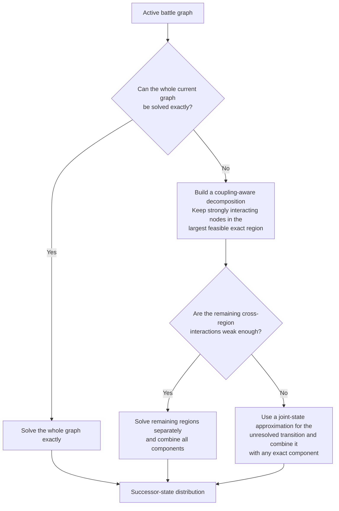

# Risk Strategy Optimization

> A multi-year computational modelling project exploring how strategies can be
> evaluated and optimized in a stochastic graph-based game.

Risk provides a useful experimental setting for a broader computational
question:

> **How should a decision-maker choose between stochastic action sequences when
> every outcome changes the state of the graph and therefore the decisions that
> become available next?**

A board position can be represented as a graph: territories are nodes, borders
are edges, ownership and troop counts define the state, and combat creates
stochastic transitions. A conquest can open a new front, close another, move
troops to a strategically different node, or make a previously impossible
action available.

The project developed around one recurring modelling problem:

> **How much of the full decision problem can be simplified, compressed or
> precomputed without discarding information needed by the next decision?**

In practice, addressing this problem requires balancing several competing
demands:

- exploring the limits of feasible computation and improving the efficiency of
exact methods;
- identifying which information in generated data must be preserved, and how that
information can be used within the structural constraints imposed by the game rules,
graph topology and current state;
- evaluating where statistical and machine-learning methods provide useful
approximations within the modelling pipeline; and
- balancing simplifying assumptions and computational approximations against the
validity of the resulting model.

These considerations recur throughout the project and continue to provide insight
into the central modelling question.

---

## Two related systems

The repository preserves two related but distinct architectures.

### Original explicit game simulator - The early arena

The project includes an early mutable Risk simulation platform under
[`src/project_risk/game_simulation/`](src/project_risk/game_simulation/):

```text
SimulationEngine.py
    ├── orchestrates players from Players.py
    ├── invokes rules and actions from SimulationFunctions.py
    └── reads and mutates territory state defined in Board.py
```

- `Board.py` defines territories, topology, ownership and troop state.
- `Players.py` defines player state, ownership and early strategy hooks.
- `SimulationFunctions.py` implements rule and state-changing helpers for
  reinforcement, combat, movement and ownership changes.
- `SimulationEngine.py` coordinates setup, turn order, turn execution and
  repeated simulation runs.

This simulator is an important historical and reusable layer for simulating
the game between players, but it is not the turn engine used by the later
mathematical `GlobalState` pipeline. No completed adapter currently installs
the advanced mathematical strategy as a player policy in `SimulationEngine`.

### Mathematical strategy pipeline - The optimization project

The later modelling system is organized by the scale and responsibility of each
layer:

```text
[Strategic goals] → [Small graphs] → [Policy libraries] → [Large graphs] → [Transition approximation] → [Multi-turn model] → [Strategic evaluation]
```

| Layer | Main responsibility | Current status |
| --- | --- | --- |
| **Strategic objectives** | Define strategic goals and utility functions | Established conceptual framework |
| **Small-graph model** | Solve local tactical policies and successor distributions exactly | Mature core |
| **Exact policy libraries** | Precompute and retrieve reusable small-graph solutions | Mature infrastructure |
| **Continent / large-graph model** | Extend the tactical policy problem to larger graphs, solving exactly where feasible and approximating only where necessary | Active research frontier |
| **Transition prediction / approximation** | Approximate large-graph successor-state distributions cheaply enough for repeated use | Experimental redevelopment |
| **Full-board model** | Propagate transitions across resources, alternating players and multiple turns | Experimental integration |
| **Strategic evaluation** | Score resulting states and compare higher-level strategic commitments | Partially implemented |

For the full conceptual account, see
[`docs/modelling_approach.md`](docs/modelling_approach.md). For module-level
design, see [`docs/architecture.md`](docs/architecture.md).

---

## Strategic objectives and model interfaces

Before a strategy can be optimized, optimality has to be defined.

Project Risk separates two tasks:

1. **Prediction:** given a state and a policy, which successor states may follow
   and with what probabilities?
2. **Evaluation:** given a possible outcome, how desirable is that outcome?

The lower modelling layers construct transition distributions at increasing
graph scales. The final evaluation layer uses those distributions to compare
higher-level strategic commitments, such as continent objectives.

This separation matters because a sophisticated utility function cannot repair
an incorrect transition model, while a correct transition model cannot choose
between policies without a preference rule.

---

## 1. Small-graph model

The small-graph model is the tactical core of the project. It combines
node-to-node combat with sequential policy optimization over a limited active
combat graph.

### Combat probabilities

`markov_matrix_probabilities.py` treats combat between two hostile territories
as a finite absorbing Markov chain. Instead of returning only the probability of
victory, it returns the complete distribution over terminal attacker and
defender troop configurations.

That distribution becomes the elementary stochastic transition kernel for the
graph solver.

### Sequential tactical policies

When several hostile edges are available, the player must choose which attack
to initiate, observe its stochastic outcome and then choose again from the new
state.

```text
[Current state] → [Choose a legal attack] → [Battle outcome] → [Updated state] → [Choose again]
```

The public source retains shared state definitions, model semantics and a
reference recursive implementation alongside the current compact exact solver.
These are two implementations of the same small-graph model, not successive
modelling stages. The current efficient calculation uses memoization and dynamic
programming over the reachable state DAG; the implementation boundary is
described in [`docs/architecture.md`](docs/architecture.md).

The local objective compares policies lexicographically using:

1. expected newly conquered territories;
2. expected final attacker troops; and
3. probability of complete local conquest.

The solver returns both an optimal value and a **joint probability distribution
over concrete terminal graph states**.

That distinction is essential. Two locally equal policies may leave surviving
troops on different nodes and therefore create different opportunities for the
next tactical problem. Later policy representations consequently preserve tied
root actions, downstream `state_set` alternatives and, for validation, fuller
exact policy DAGs.

### Troop-count scaling: from plateau to exact computation

The earliest practical scaling problem was high troop counts on otherwise small
graphs. The historical sequence was:

```text
[Explicit recursion] → [Plateau approximation] → [Memoized dynamic programming] → [Compact exact solver] → [Higher exact troop caps]
```

The plateau approach predated the later dynamic-programming solution. Once
repeated successor states could be reused efficiently, extrapolation was no
longer necessary for the intended small-graph range.

This is separate from the large-graph scaling problem. Troop-count scaling on a
fixed small topology became primarily an exact-computation problem; scaling the
number of interacting nodes remains the responsibility of `continent_model`.

---

## 2. Exact policy libraries

Solving one small graph exactly is useful, but a larger simulation or transition
generator may encounter equivalent local structures repeatedly. `create_library.py`
therefore precomputes exact policies for supported small graphs and reuses them
through a library interface.

The library idea predates the current exact finite solver and initially stored
matrices of terminal state distributions. Better solvers and library formats later
allowed the library to cover higher troop caps, more topologies and richer
policy outputs.

### Offline generation

```text
[Graph topology] → [Canonical form] → [Troop configurations] → [Exact policy solution] → [Policy alternatives] → [Terminal-state distributions] → [Indexed library]
```

### Runtime lookup

```text
[Graph region] → [Normalize roles] → [Canonical form] → [Troop row] → [Library lookup] → [Policy distributions] → [Map back]
```

Canonicalization allows differently labelled but role-equivalent graphs to
share one exact solution. Later library formats use compact vectorized payloads,
graph-level indexes and chunked storage so that only the required rows need to
be loaded.

Restricted graph families, particularly star topologies, extend exact coverage
to otherwise awkward attacker/defender count combinations without pretending
that every topology of the same size has been solved.

The research archive contains millions of solved states and many gigabytes of
generated library artifacts. Those artifacts are documented but not distributed
in this public repository.

---

## 3. Continent / large-graph model

The large-graph layer extends the same tactical policy problem beyond the graph
sizes covered by one precomputed exact-library entry. Its current implemented
route combines exact regional policies; its exact-first routing is a
validation-informed future direction rather than an integrated runtime.

### Use the largest exact regions available

If the full active battle graph cannot be represented by one existing exact
library solution, the implemented regional model divides it into smaller
exact-supported regions. Whenever the same nodes can be represented either as
several smaller exact regions or one larger exact region, the larger region is
preferred.

This keeps more interacting nodes inside one exact calculation and reduces the
number of dependencies that must be approximated across region boundaries.

> **Keep as much of the interacting graph together as can be solved exactly.**

The implemented regional route is approximately:

```text
[Active battle graph] → [Largest supported regions] → [Exact regional policies] → [Partition-policy candidates] → [Downstream evaluation]
```

A partition can contain several regions, and each region can contain several
policies with the same local utility. Those policies are not necessarily
interchangeable: they may leave ownership and troops in different successor
states and therefore create different opportunities in the next wave. Policy
identity is retained where downstream evaluation depends on that difference.

### The main approximation comes from splitting the graph

Each region can be solved exactly using the small-graph model and exact policy
libraries. The large-graph approximation enters when the regional problems are
treated as separate stochastic components.

If two regions do not influence one another's available actions or optimal
decisions, their exact successor-state distributions can be combined directly.
Monte Carlo is not required merely to combine already-known independent
regional distributions.

The difficult case is interaction across a region boundary. An outcome in one
region may:

- open a new front in another region;
- change where surviving troops remain;
- change which attacks become available; or
- change which next action is optimal.

Splitting such nodes removes part of their dependence before the regional
policies are evaluated.

#### What second-wave Monte Carlo does

Second-wave Monte Carlo partially addresses the problem of lacking interaction 
between regions by sampling concrete regional outcomes, reconstructing the 
resulting global state and evaluating the next tactical situation.

```text
[Sample regional outcomes] → [Reconstruct large state] → [Rebuild battle graph] → [Repartition] → [Evaluate next wave]
```

This captures interactions that appear after the first
wave, but it cannot recover dependencies that were already lost when the initial
graph was divided.

The quality of the regional approximation therefore depends mainly on how
strongly the regions interact.

### What validation showed

To evaluate the regional approximation, several experiments compared its predicted 
successor-state distribution $P$ with an exact distribution $Q$ of the same problem 
using total variation distance.

$$
\mathrm{TV}(P, Q) = \frac{1}{2}\sum_s \lvert P(s) - Q(s) \rvert.
$$

A value of $0$ means identical distributions; values closer to $1$ indicate
increasingly different distributions.

| Question tested | What was observed | What it means |
| --- | --- | --- |
| Can graphs outside normal library coverage sometimes still be solved exactly when only the current state is required? | All $360/360$ test cases completed; the slowest took about $0.78\,\mathrm{s}$. | Library coverage is not the same as the runtime limit for one exact solve. |
| Is Monte Carlo needed merely to combine already-known independent regional distributions? | Direct calculation took about $0.0005\,\mathrm{s}$, compared with about $4.0\,\mathrm{s}$ for $10{,}000$ samples. The sampled distribution had TV error $0.0035$. | For a tractable product distribution, direct calculation is faster and exact for the assumed independent-regions model. |
| How accurate is regional splitting when interaction is weak? | Mean TV was $0.0061$. | The approximation can be very close to exact in weakly coupled cases. |
| What happens when regions interact strongly? | Mean TV was $0.798$. | Splitting can discard essential sequence dependence and produce a poor approximation. |
| Can better regional policy selection repair decomposition errors? | Candidate selection changed in $15/50$ cases, but all seven previous $\mathrm{TV}=1$ failures remained. | Better ranking cannot recover dependencies already discarded by the split. |
| Can equal-valued policies be treated as interchangeable? | Equal local values produced materially different successor-state distributions. | Policy identity must be retained where downstream states matter. |

See [`docs/validation.md`](docs/validation.md) for experimental conditions,
exact output and provenance.

### Exact-first direction

The policy-library coverage limit is not necessarily the limit for solving one
current graph state exactly. Building a reusable library requires solving many
topologies, troop configurations and initial states. At runtime, an exact attempt
may need to solve only the current topology and current state.

A graph outside the precomputed library coverage can therefore still be
tractable as a one-off exact solve. This changed the preferred order of
reasoning:

1. Try to solve the whole current active battle graph exactly.
2. If that is too expensive, keep strongly interacting nodes together in the
   largest exact calculation that is feasible.
3. Continue to model every excluded node. The exact region is one component of
   a coupling-aware decomposition, not a solution for the whole graph.
4. Use the existing regional model for the remaining regions only when
   interaction across their boundaries is weak enough for the independence
   approximation to be defensible.
5. If important unresolved dependencies remain, use a joint-state approximation
   rather than treating them as independent.



The exact-first, coupling-aware router is a **target architecture informed by
validation**. It is not currently a fully integrated automatic runtime router,
and the general rule for identifying the smallest sufficient coupled region
remains open.

---

## 4. Transition prediction and machine learning

The statistical and machine-learning work is a **surrogate-modelling branch of
the large-graph pipeline**.

The dependency is:

```text
[Initial large-graph state] → [Expensive regional model] → [Generated successor target] → [Statistical or ML surrogate]
```

The surrogate was intended to reproduce an expensive transition process cheaply
enough for repeated use. It was not an independent replacement for the combat,
graph or policy semantics below it.

### Macro statistical models

Initially, regression models, GLMs and GAMs were used in an attempt to extract 
useful macro patterns from the game board. These models used strategic descriptors 
such as troop- and territory balance, concentration, topology and reserve distance 
together with predicted outcomes from the continent model in order to associate 
the macro states with specific outcomes on the board.

Although this approach proved to be problematic in many ways (see
[`docs/modelling_approach.md`](docs/modelling_approach.md)), 
the concept of associating strategic descriptors with outcomes was kept 
and further elaborated. 

### Node-level Random Forest models

The RF models predicted ownership and troop outcomes for individual
nodes. Models achieved strong metrics relative to their generated
labels, including capture ROC-AUC values around $0.985$ – $0.995$.

The larger limitation was target validity. The labels inherited older local
utility functions, plateau-based high-troop policies, unvalidated regional
decomposition and incomplete edge-case coverage. Row-level train/test splits
could also overstate generalization.

The correct interpretation is therefore that the Random Forests reproduced
their generated targets with high predictive performance while the validity of
those targets as optimal large-graph play remained uncertain.

### Joint successor-state prediction

Independent node marginals do not necessarily form one legal board. Later work
therefore shifted toward distributions over complete successor signatures and
an experimental retrieval/KNN-style model.

This preserves correlated ownership and troop outcomes because every node in a
signature comes from the same realized transition. The joint-state model should
nevertheless be retrained only after the exact-first, coupling-aware large-graph
target generator and policy-tie semantics have been corrected and validated.

---

## 5. Full-board multi-turn model

A continent-scale transition describes primarily one active player's combat
process. A full-board turn also includes reinforcement allocation, troop
redistribution, fortification, competing continent objectives, shared frontiers
and alternating player perspectives.

The mathematical full-board layer under `full_board_model/` chains these
responsibilities around the transition model. It is distinct from the original
`SimulationEngine` architecture described earlier.

Two modelling generations are retained:

1. a historical RF-based rollout that demonstrated alternating-player and
   resource-allocation architecture but inherited the weaknesses of its
   transition targets; and
2. a later joint-state particle direction intended to propagate uncertainty as
   a bounded distribution over coherent boards.

The latest exact-first and coupling-aware conclusions from `continent_model`
have not yet been integrated end to end through this layer. The preferred order
is to validate the large-graph target generator, rebuild the learned transition
model and only then reconnect the full-board rollout.

---

## 6. Strategic evaluation

Strategic objectives frame the pipeline at the beginning; their concrete
evaluation modules consume its outputs at the end.

`utility_terminal.py` scores compatible terminal or horizon states independently
of whether they were produced by an exact solver, regional approximation,
learned transition or multi-turn rollout.

`game_theory_commitment.py` enumerates higher-level commitment profiles, invokes
compatible full-board rollouts and converts resulting states into payoff tables:

```text
[Commitment profile] → [Multi-turn rollout] → [Terminal state] → [Terminal utility] → [Payoff table]
```

The term *game theory* is narrow in the current implementation. This layer
constructs and compares strategic payoff structures; it does not currently
solve for or select a Nash equilibrium.

---

## Research source and reproducible demo

The repository exposes two deliberately separate surfaces.

**Actual research source:** [`src/project_risk/`](src/project_risk/)

```text
game_simulation/
mathematical/
    small_graph_model/
    libraries/
    continent_model/
    transition_prediction_ml/
    full_board_model/
    strategic_evaluation/
infrastructure/
validation/
```

**Runnable example:** [`examples/run_exact_example.py`](examples/run_exact_example.py)

**Demo documentation:** [`demo/exact_demo/`](demo/exact_demo/)

**Optional presentation:** [`demo/visualization/`](demo/visualization/)

The example imports and exercises the authoritative `project_risk` source. It is
an orchestration layer, not a second mathematical implementation.

### Run the exact example

The self-contained example contains one attacker node with four troops and two
adjacent one-troop defender nodes.

```bash
python -m pip install -e .
python examples/run_exact_example.py
```

Expected output includes:

```text
Lexicographic value: (1.496647620, 2.878787620, 0.580098240)
Canonical optimal opening attack: (0, 1)
Exactly tied optimal opening attacks: 2
Terminal support: 4 states
Probability mass: 1.000000000000
```

The example demonstrates absorbing Markov combat transitions, exact finite-state
dynamic programming, graph semantics, optimal policy selection, tied policies
and terminal-state distributions.

It is a **reproducible window into the mathematical core**, not the complete
Project Risk model.

---

## Repository guide

- [`docs/modelling_approach.md`](docs/modelling_approach.md) — conceptual
  account organized by the current modelling pipeline.
- [`docs/architecture.md`](docs/architecture.md) — technical architecture of
  the same pipeline and the separate original simulator.
- [`docs/validation.md`](docs/validation.md) — validation results, evidence
  classes, conditions and caveats.
- [`src/project_risk/`](src/project_risk/) — reusable research source.
- [`examples/`](examples/) and [`demo/`](demo/) — runnable example and optional
  presentation material.
- [`tests/`](tests/) — public combat, solver, canonicalization, policy and
  distribution tests.
- [`validation/`](validation/) — reproducible public validation and selected
  retained historical evidence.

---

## Public repository versus research archive

The original research archive remains substantially larger than this public
repository. Reusable source for the original simulator and the exact, library,
continent, transition-prediction, full-board, strategic-evaluation and selected
validation layers is included under `src/project_risk/`.

The public repository excludes:

- generated exact policy libraries;
- trained model bundles and large datasets;
- research output and checkpoint trees;
- one-off experiment runners and temporary diagnostics;
- third-party papers and commercial board artwork.

Source inclusion does not imply that every experimental route has the generated
artifacts needed for an end-to-end run.

---

## Scope and limitations

Project Risk is a modelling research project, not a complete implementation of
optimal play for the commercial board game.

Important limitations include:

- the tactical objective is a modelling choice rather than a universal
  definition of optimal Risk play;
- combat uses a fixed local battle policy and an inherited probability table
  rounded to three decimals;
- exact state enumeration remains combinatorial;
- regional approximation is reliable only where its coupling assumptions are
  defensible;
- historical node-level ML results require stronger grouped validation;
- the smallest sufficient coupled region remains an open problem;
- the exact-first router has not yet been integrated into one complete
  multi-turn production pipeline; and
- the original explicit simulator and the mathematical full-board route remain
  separate architectures.

These limitations are part of the modelling problem rather than hidden
implementation details.

---

## What the project revealed

The central result of Project Risk is not one final algorithm. It is a clearer
understanding of what a stochastic strategy model must preserve.

- Broad strategic predictions may be accurate while being unable to produce a
  legal next state.
- Accurate node marginals may fail to form one coherent joint outcome.
- Equal local policy values may conceal different future opportunities.
- Exact regional models may each be correct while their independent
  decomposition is wrong.
- Repeating a transition over several turns magnifies every earlier
  representation choice.

These observations led to the principle that now connects the project:

> **Information may be discarded only when it is irrelevant not merely to the
> current objective, but also to the decisions that consume the model's output.**
