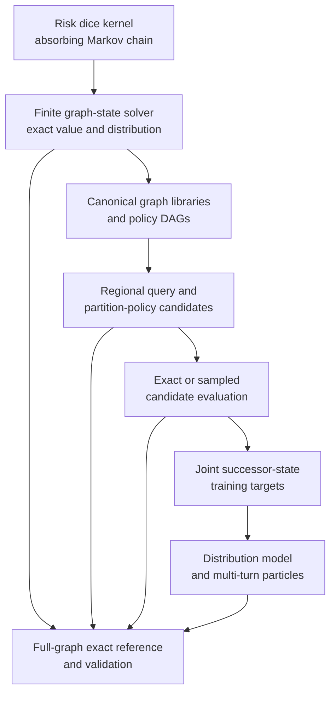
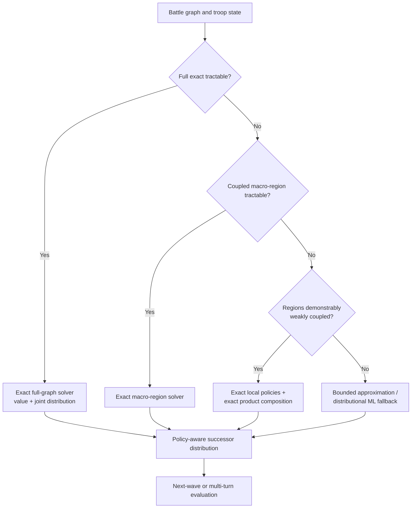

# Project Risk: modellutvecklingens historia

> **Dokumentstatus:** Historisk rekonstruktion, sammanställd 2026-08-13  
> **Avsedd användning:** Teknisk projektdokumentation för människor och Codex  
> **Täckt period:** cirka juli 2024–18 juli 2026  
> **Säkerhetsnivå:** Blandad. Varje större påstående är märkt enligt evidensnyckeln nedan.

## Evidensnyckel och avgränsning

Det här dokumentet rekonstruerar hur Project Risk utvecklades, inte bara hur den senaste koden fungerar. Rekonstruktionen bygger på tre typer av material:

- **[CHAT]** Direkt belagt i bevarade ChatGPT-konversationer, framför allt projekttråden *Combat Graph Optimization* från 16 juni till 18 juli 2026 och den senare CV-diskussionen.
- **[REPO]** Direkt belagt i daterade filer, kod, notebookar eller genererade rapporter i det lokala repot `project_risk`.
- **[INFERENS]** En rimlig tolkning av ordningsföljd, avsikt eller orsak, men inte uttryckligen dokumenterad i en chatt eller rapport.
- **[LUCKA]** Något som inte kan fastställas med det tillgängliga materialet.

När ett stycke innehåller flera evidenstyper anges den svagaste relevanta nivån. Numeriska resultat återges bara när de finns i chattloggar eller sparade rapporter. Tidiga filers ändringsdatum används som kronologiska hållpunkter, men de bevisar inte i sig exakt när en idé först uppstod.

Det lokala Git-repot har bara ett bevarat commitsteg, `Initial commit` från 9 januari 2026. Git-historiken kan därför inte användas som en komplett utvecklingsdagbok. Den tidiga historiken före juni 2026 är i hög grad en artefaktbaserad rekonstruktion.

---

## Executive summary

Project Risk började som ett försök att modellera strider och beslut i brädspelet Risk. Projektet växte gradvis från Monte Carlo-simulering, eventträd och lokala heuristiker till ett mer generellt problem: att optimera sekvenser av stokastiska anfall på en graf och beräkna den fullständiga fördelningen över absorberande slutlägen. **[REPO; INFERENS]**

Den centrala tekniska utvecklingen kan sammanfattas i fem faser:

1. **Simulering och explicita händelseträd, 2024–tidigt 2025.** Tidiga program representerade spelbrädet med grannskapsmatriser, simulerade strider, testade SMC-, MCTS- och Monte Carlo-varianter och analyserade lokala mål eller Pareto-dominans. En senare notebook formulerade problemet som ett träd av val och stokastiska utfall och noterade att återkommande tillstånd borde delas i stället för att dupliceras. **[REPO]**

2. **Exakt lokal stridsmodell och rekursiv grafoptimering.** En absorberande Markovkedja blev den exakta kärnan för en enskild Risk-strid. Ovanpå den byggdes ett grafproblem där varje tillstånd består av ägare och truppantal per nod, varje legal attack är en handling och varje helt utkämpad strid ger en fördelning över efterföljartillstånd. Rekursiv optimering och memoization gav en ändlig Bellman-liknande lösare. **[CHAT; REPO]**

3. **Canonicalization, exakta bibliotek och policyrepresentation.** Grafer canonicaliserades under isomorfier som bevarar attacker-/försvararroller. Lösningar lagrades i chunkade bibliotek och återanvändes mellan likvärdiga topologier. Policyrepresentationen utvecklades från en enda deterministisk policy till root alternatives och därefter `state_set`-alternativ som kan skilja sig i beslut långt ned i spelträdet, trots samma rotval och samma lexikografiska värde. **[CHAT; REPO]**

4. **Regional approximation, tvåstegsurval och distributionsinriktad ML.** Större grafer delades i regioner vars lokala policyfördelningar kombinerades. Ett tvåstegsförfarande rankade först lokalt optimala partition-policy-kandidater och använde sedan nästa-vågsvärde för att bryta relevanta likheter. ML-spåret flyttades från oberoende nodprognoser till modeller av hela efterföljartillståndets gemensamma fördelning, följt av sekventiell fullbrädes-simulering med ett begränsat antal partiklar. **[CHAT; REPO]**

5. **Valideringsdriven exact-first-pivot, juli 2026.** Kontrollerade jämförelser visade att oberoende regional sammansättning fungerar mycket bra för svagt kopplade topologier men kan misslyckas fullständigt när stridssekvenser öppnar nya fronter eller byter region beroende på utfallet. Samtidigt var full exakt lösning mycket billigare än tidigare konservativa gränser antydde. Projektets validerade målarkitektur blev därför: full exakt graf när den är praktiskt lösbar, annars en exakt kopplad macro-region, exakt sammansättning endast för genuint svagt kopplade regioner och approximation sist. **[CHAT; REPO]**

Den viktigaste negativa lärdomen är att lokalt optimala policyer och lokala absorberande fördelningar inte i allmänhet komponerar till ett globalt exakt svar. Boundary context, sekvensöppningar och utfallsberoende fortsättningar spelar roll. Den viktigaste positiva lärdomen är att tillståndsrummet i praktiken är betydligt mindre än lösa kombinatoriska övre gränser, vilket gjorde en exact-first-strategi realistisk för fler fall än väntat. **[CHAT]**

Senaste dokumenterade läge, 18 juli 2026: den canonicala exakta lösaren beräknar redan fulla optimala fortsättningar; policy-DAG-exporten kan dessutom exponera alternativa exakt bundna policyer på olika djup. Canonicalization-invarians och värde/distribution för canonical policy validerades. Exakta bundna policyer kan dock ha materiellt olika övergångsfördelningar. Den nya exact-first-routingen var ännu inte inkopplad i produktion, Stage A-data hade inte regenererats, Stage B-modellen hade inte tränats om och Stage E-valideringen hade inte startat. **[REPO]**

---

## 1. Problemformulering och ursprunglig målbild

### 1.1 Från Risk till ett stokastiskt grafproblem

Den spelmässiga kärnan är enkel att beskriva men svår att optimera: territorier är noder i en graf, möjliga angrepp följer kanterna, noder ägs av attackeraren eller försvararen och truppantal förändras stokastiskt genom Risk-tärningar. Ett beslut påverkar inte bara sannolikheten att vinna den omedelbara striden, utan också vilka fronter som öppnas, var trupperna hamnar och vilka fortsatta anfall som blir möjliga. **[CHAT; REPO]**

Den formella lokala uppgiften blev därför:

- givet en liten attacker-/försvarargraf och ett initialt trupparrangemang,
- välj legala anfall och, där reglerna tillåter det, hur många trupper som flyttas efter erövring,
- optimera ett definierat lexikografiskt mål,
- och beräkna hela den absorberande utfallsfördelningen, inte bara ett väntevärde eller en vinstsannolikhet.

Det sistnämnda är avgörande. Ett väntevärde räcker inte när nästa beslutsvåg beror på den konkreta efterföljande brädställningen. Två policyer kan ha samma lokala nyttovärde men lämna olika trupp- och ägarfördelningar, vilket gör dem strategiskt olika i nästa steg. **[CHAT]**

### 1.2 Ursprungligt mål

Den tidigaste explicit återgivna målbilden i den bevarade projektchatten var att bygga bibliotek för små stridsgrafer, beräkna optimala eller nära optimala policyer och absorberande slutlägesfördelningar och sedan återanvända eller komponera dessa lösningar på större grafer. **[CHAT, 2026-06-16]**

Repositoryartefakter visar att ambitionen föregick denna formulering. Redan 2024 fanns brädkod, isolerade stridssimuleringar, multi-simulation, Monte Carlo-varianter och sökmetoder. Notebooken `Gammalt/Explicit approach/Risk_Model.ipynb` från mars 2025 beskriver uttryckligen ett val mellan att först simulera sannolikhetsfördelningar och att beräkna explicita sannolikheter för att därefter simulera. Den valde den senare riktningen och representerade problemet som växlande val- och utfallsgrenar. **[REPO]**

Den exakta ursprungliga formuleringen, första startdatumet och den personliga motivationen finns inte bevarade i de tillgängliga chattarna. Att projektet startade som en fullständig Risk-AI och senare smalnade av till en generell stridsoptimerare är möjligt, men inte tillräckligt belagt för att anges som faktum. **[LUCKA]**

### 1.3 Arkitektonisk grundidé

Den arkitektur som gradvis växte fram har en tydlig lagerstruktur:

Det är viktigt att skilja mellan den **implementerade historiska arkitekturen** och den **senast validerade målarkitekturen**. Regional library lookup, tvåstegsrankning och ML-pipeline finns implementerade i olika stadier. Exact-first-routing med macro-regioner framstår i de senaste rapporterna som den riktning resultaten stödjer, men den hade ännu inte ersatt produktionsflödet. **[REPO, 2026-07-18]**

---

## 2. Kronologisk tidslinje

| Period | Milstolpe | Evidens och betydelse |
|---|---|---|
| Jul–aug 2024 | Tidiga bräd- och stridssimuleringar | `Old_Game_Board`, setup-, adjacency- och simulationfiler. Grafen representerades med grannskapsmatris och legala angrepp filtrerades på kant, ägare och truppantal. **[REPO]** |
| Aug 2024 | Explicit uppräkning av stridsförlopp | Rekursiv `simulate_battle` byggde händelsekedjor och sannolikheter. Filnamnet `Simuleringsprogram med för många operationer` visar ett identifierat beräkningsproblem, men exakt flaskhalsanalys saknas. **[REPO]** |
| Aug–sep 2024 | SMC, MCTS och Monte Carlo | Separata SMC-, MCTS- och Monte Carlo-program. SMC använde 100 000 scenarier och en starkaste-nod-heuristik; MCTS 10 000 iterationer; Monte Carlo-filer 100 000 simuleringar. **[REPO]** |
| Sep–dec 2024 | M1–M4, capability lookup och mål | Simulations-/analys-CSV:er, subgrafklassificering, lookup av förberäknade expected values/success coefficients, additiva mål och Pareto-analys. **[REPO]** |
| Mar 2025 | Explicit probabilistisk modell | Notebook med val- och utfallsträd; noterade att återkommande tillstånd bör peka till redan byggda delträd, en tidig DAG/memoization-idé. Exempel `(4,3)` gav en state-tree-vektor `[1406, 1776]`. **[REPO]** |
| Senast jan 2026 | Första samlade Git-snapshot | Repot har ett enda bevarat commitsteg. Det begränsar möjligheten att exakt datera mellanliggande pivoter. **[REPO]** |
| Före 16 jun 2026 | Markov-kärna, small-graph solver och bibliotek | Exakt absorberande stridsmodell, rekursiv grafoptimering, canonicalization, chunkad lagring och `policy_options_v2` fanns redan. **[CHAT; REPO]** |
| 16 jun 2026 | Plateau- och compositionality-problem formaliseras | Plateau-byggaren hade ett forwarding-fel. Djupare problem: stabila root actions eller lokala optimala policyer är inte globalt kontextoberoende. **[CHAT]** |
| 16–17 jun 2026 | “Puzzle method” omvärderas | Små exakta motiv är säkra som transition operators/macro-actions under en överordnad solver, men inte som kontextfria, globalt exakta policyer. **[CHAT]** |
| 17 jun 2026 | Pivot till exact finite solver | Truppcap visade sig typiskt vara 7 och sällan över 10. Praktiskt nåbara tillstånd var mycket färre än lösa gränser. En kompakt delad-cache-lösare byggdes. **[CHAT]** |
| Jun–jul 2026 | Exakta bibliotek skalas upp | Exempelvis 98 canonicala 2A3D-grafer och 1 647 086 rader byggdes på 986 s utan fel. **[CHAT]** |
| 8 jul 2026 | `state_set`-policyer valideras | Alternativa policyer med samma rotval men olika nedströmsbeslut kunde representeras. Policy splitting definierades från lövsidan. **[CHAT]** |
| 9 jul 2026 | Tvåstegs partition-policy-ranking | Först lokalt konsistent nytta, därefter nästa-vågsutvärdering av kvarvarande kandidater. Policyidentitet och distributionsskillnader bevarades. **[CHAT]** |
| 10 jul 2026 | ML korrigeras till gemensamma tillståndsfördelningar | Oberoende nodmarginaler bedömdes otillräckliga. Stage A–D byggdes kring konkreta successor states, KNN-distributioner och fullbrädes-partiklar. **[CHAT; REPO]** |
| 15 jul 2026 | Partitionssemantiken korrigeras | Exakt coarsening prioriteras framför fragmentering. Bara maximala, icke-dominerade full-cover-partitioner ska jämföras. Ägarrolls- och universummismatchar hittades och rättades. **[CHAT]** |
| 17 jul 2026 | Candidate MC skiljs från target MC | Återanvändning gav upp till 19,36× speedup. Låga MC-budgetar visade stor instabilitet; Stage A v2 blev inte träningsgodkänd. **[CHAT]** |
| 17 jul 2026 | Regional compounding validation v1 | 50 exakta benchmarkfall visade bimodalt beteende: många nästan exakta fall men katastrofala double-front/sequence-opening-fall. Exakt produktsammansättning var extremt billig och bättre än target MC. **[CHAT]** |
| 18 jul 2026 | Exakt regional candidate selection v2 | Exakt kandidaturval tog bort urvalsbrus men löste inte dekompositionsfelet. Full exakt lösning visade sig praktisk inom bredare gränser än väntat. **[CHAT]** |
| 18 jul 2026 | Exact policy DAG validation v1 | Full policy-DAG och alternativa bundna policyer analyserades. Canonical invariance höll; vissa exakt bundna policyer hade tydligt olika övergångsfördelningar. Produktion och ML-data ändrades ännu inte. **[REPO]** |

---

## 3. Metodutveckling, steg för steg

### 3.1 Tidiga simuleringar, SMC, MCTS och lokala heuristiker

De äldsta daterade filerna visar flera parallella sätt att göra problemet hanterbart. `BattleGraph` använde en adjacency matrix och identifierade en attack som legal när källan och målet var grannar, ägarna skilde sig och källan hade mer än en trupp. Isolerade strider kunde simuleras rekursivt och utfallen sparas med sannolikheter. **[REPO]**

Följande experiment finns bevarade:

- `SMC Simulation.py`: 100 000 scenarier och en heuristik som angriper från den starkaste noden.
- `MCTS approach.py`: selection, expansion, simulation och backpropagation med 10 000 iterationer.
- `Monte carlo approach.py` och en variant med expected value: 100 000 simuleringar.
- M1–M4-familjer av simulations- och analysdata.
- `GetBattleChainCapabilities.py`: klassificerade små delgrafer och slog upp förberäknade CSV-värden för expected outcome och success coefficients.
- `AnalyzeSetups.py`: använde Pareto-optimalitet över flera mål.

Detta etablerar att sampling, trädsökning, förberäknade lokala motiv och flerobjektivsanalys prövades tidigt. **[REPO]**

Det går däremot inte att belägga en ren sekvens där en metod definitivt ersatte en annan, eller varför SMC och MCTS lades åt sidan. Att de ligger i `Gammalt` och inte i den aktiva lösningskedjan visar att de inte längre är huvudvägen. Det är rimligt att anta att sampling error, dyr upprepning och svårigheten att bevara hela distributions- och policystrukturen bidrog, men detta är en inferens, inte dokumenterad projektfakta. **[INFERENS; LUCKA]**

### 3.2 Explicita eventträd och övergången till en DAG

Notebooken `Explicit approach/Risk_Model.ipynb` representerade modellen som växlande val- och utfallsgrenar. Den jämförde att först simulera sannolikhetsfördelningar med att explicit beräkna sannolikheter och därefter simulera. Den explicit-probabilistiska riktningen valdes. **[REPO]**

Notebookens mest framtidsvisande observation var att ett nytt tillstånd inte behöver få en separat kopia av hela sitt efterföljande eventträd. Om tillståndet redan är definierat kan grenen peka på samma delstruktur. Det är exakt den strukturella övergång som förvandlar ett explosivt träd till en ändlig directed acyclic graph med memoization. **[REPO; INFERENS]**

Det tidiga exemplet för stridsläget `(4,3)` rapporterade en state-tree-vektor `[1406, 1776]`. Materialet förklarar inte helt vad båda komponenterna räknar, så värdet bör inte återanvändas som ett generellt benchmark utan notebookens definition. **[REPO; LUCKA]**

### 3.3 Exakt Markov-chain combat

Den moderna stridskärnan finns i `markov_matrix_probabilities.py`. Den bygger en absorberande Markovkedja för en enda, helt utkämpad Risk-strid. **[REPO]**

Tillstånden delas i:

- transienta tillstånd `(a,d)` där både attackerande och försvarande arméer återstår,
- absorberande tillstånd `(0,d)` där attacken har misslyckats,
- och absorberande tillstånd `(a,0)` där försvararen har slagits ut.

Övergångsmatrisen delas i `Q` och `R`. Med fundamentalmatrixen

\[
N=(I-Q)^{-1}
\]

beräknas absorptionssannolikheterna som

\[
F = NR.
\]

Koden exponerar bland annat vinstsannolikhet, förväntade förluster, standardavvikelse, sammanfattningar och hela `F_df`. Tärningssannolikheterna kommer från en tabell som i koden attribueras till Osborne. **[REPO]**

I grafsolverns handlingar används inte ett enda tärningskast som transition. I stället används raden i `F_df` för hela striden med utgångsläget `(source_troops - 1, defender_troops)`. Den strategiska solvern väljer alltså **vilken full strid** som ska utkämpas; Markovkedjan integrerar exakt över alla interna tärningsrundor. **[CHAT; REPO]**

Detta är ett avgörande arkitekturval. Det reducerar djupet i den strategiska DAG:en och separerar lokal spelmekanik från global policyoptimering utan att introducera Monte Carlo-brus i enskilda strider.

### 3.4 Grafrepresentation och globala tillstånd

I `small_graph_outcome_probabilities.py` representeras ett tillstånd som `GlobalState(nodes=(NodeState(owner,troops), ...))`. En handling `(u,v)` är legal när `u` ägs av attackeraren, har fler än en trupp och är granne med en försvararnod `v`. Tillståndet är absorberande när det saknas attackerare, saknas försvarare eller inte finns något legalt anfall. **[REPO]**

Efter en erövring måste trupper flyttas till den nya noden. Om ursprungsnoden har andra fientliga grannar kan solvern jämföra minstaflytt mot att trycka fram alla utom en trupp. Om ingen annan fiendegranne finns blir framflyttningen tvingad. Det gör movement till en del av policyn, inte bara en efterbehandling. **[REPO]**

Denna representation löser ett problem som rena node-marginaler senare återintroducerade: ett giltigt successor state måste samtidigt respektera ägare, trupper, sammanhängande konsekvenser av striden och efterföljande legala handlingar.

### 3.5 Utility och objectives

Projektet har använt flera målformuleringar. De bör inte blandas ihop.

#### Legacy objective

En äldre utility jämförde lexikografiskt först sannolikheten för total framgång och därefter attackertrupper på noder som ursprungligen tillhörde försvararen. Koden själv markerar att denna definition är diskutabel. **[REPO]**

#### Context-independent local objective

Den senare lokala målfunktionen blev i standardfallet:

1. förväntat antal nya territorier,
2. förväntat antal kvarvarande attackertrupper,
3. sannolikhet för full lokal erövring.

Med `include_no_gain` läggs sannolikheten att inte vinna något territorium in med negativt tecken före truppmåttet. Jämförelsen är lexikografisk med toleranser, inte en godtyckligt viktad summa. **[CHAT; REPO]**

#### Partition- och nästa-vågsmål

När flera regioner kombineras räcker inte en lokal scalar. Den senare tvåstegsmetoden jämför först kandidater med en lokalt konsistent sammansatt utility och behåller exakta ties. Därefter utvärderas den globala efterföljaren och nästa stridsvåg. Detta separerar lokal optimalitet från strategiskt framtidsvärde. **[CHAT]**

En viktig korrigering var att produktionsrankaren först använde närliggande men inte identiska globala mått. Den ändrades så att jämförelsen inom en partition använder samma semantik som skapade de lokala policyalternativen, innan global lookahead tillämpas. **[CHAT]**

#### Äldre additiva och spelteoretiska mål

Repot innehåller även äldre additiva mål, Pareto-analys, `NashEquilibria.py` och `UtilityFunction.py` för strategiprofiler och kontinentnivå. De visar ett bredare intresse för fleraktörsnytta och jämvikter, men den bevarade historiken knyter dem inte tydligt till den moderna battle-solverns huvudlinje. **[REPO; LUCKA]**

### 3.6 Rekursiv exact solving och dynamic programming

När en handling är vald ger Markov-kärnan en ändlig mängd efterföljartillstånd. Varje övergång minskar försvar, flyttar ägande eller uttömmer möjligheten till fortsatt attack. Det strategiska problemet kan därför behandlas som en ändlig DAG och lösas med backward induction/Bellman-liknande rekursion. **[CHAT; REPO]**

Den rekursiva solvern behöver för varje tillstånd:

1. generera legala strider och movement-val,
2. slå upp hela stridens exakta absorptionsfördelning,
3. mappa varje stridsutfall till ett nytt graftillstånd,
4. lösa eller återanvända värdet för varje efterföljare,
5. aggregera utility och absorberande slutdistribution,
6. välja lexikografiskt optimala handlingar och vid behov bevara ties.

Detta är dynamic programming i praktisk mening, men inte en approximerad oändlig-horisont-MDP. Tillståndsgrafen är ändlig för en fixerad topologi och truppcap, och solvern beräknar exakta värden under de specificerade reglerna och målfunktionen. **[CHAT]**

### 3.7 Canonicalization, caching och precomputed libraries

Grafcanonicalization utnyttjar isomorfier som bevarar rollerna attackerare och försvarare. Attackerarnoder kan permuteras sinsemellan och försvararnoder sinsemellan, men rollerna får inte blandas. En canonical representant väljs och lösningen kan sedan mappas tillbaka till den märkta frågegrafen. **[CHAT; REPO]**

Detta ger tre vinster:

- topologiskt likvärdiga grafer löses bara en gång,
- cacheträffar delas mellan många truppkonfigurationer på samma topologi,
- biblioteket kan indexeras kompakt efter canonical topologi och row label.

`canonicalize_graphs.py` hanterar topologicache. `create_library.py` och relaterade byggare producerar bibliotek. `library_io.py` lagrar chunkade payloads. En tidig inspektion i projektchatten fann 2 158 payloads, alla `policy_options_v2`, och inga äldre `exact_df`-payloads. **[CHAT]**

De moderna biblioteksraderna lagras sparsamt/vektoriserat, bland annat sannolikhetsvektor `p` och arrays för ägare och trupper, med mapping från row labels. Biblioteket är alltså inte bara en tabell med väntevärden; det bevarar policy-specifika absorberande fördelningar. **[CHAT; REPO]**

### 3.8 Plateau-approximationen och varför den blev problematisk

Plateau-idén försökte extrapolera från högre truppnivåer. Om den bästa root action verkade stabil kunde en fast policymall utvärderas i stället för att lösa allt exakt. **[CHAT]**

Ett konkret implementeringsfel upptäcktes: plateau-byggaren accepterade multi-policy- och `state_set`-inställningar men vidarebefordrade dem inte till den lägre byggaren. Resultatet kunde därför se korrekt konfigurerat ut utan att faktiskt använda den avsedda policylagringen. **[CHAT, 2026-06-16]**

Det djupare problemet var metodiskt. Att tärningskärnan eller rotbeslutet stabiliseras innebär inte att det globala värdet av ytterligare trupper stabiliseras. En mall av typen “gör detta drag tills det inte går” är för grund när movement, alternativa fronter och senare beslut ändras med utfallet. Plateau-idén kan vara en heuristik eller kompression, men den ger inte i sig ett bevis för exactness. **[CHAT]**

### 3.9 “Puzzle method”: lokala motiv som byggblock

Ett alternativ var att lösa små två- eller trenodsmotiv exakt och komponera dem till större pussel. Projektchatten nådde en viktig distinktion:

- en liten exakt lösning kan säkert användas som **transition operator** eller **macro-action**,
- men dess lokalt optimala policy är inte nödvändigtvis optimal när motivets rand möter en större graf,
- och en överordnad solver måste behålla möjligheten att välja primitiva handlingar om global exactness ska hävdas.

En lösare som bara optimerar bland tillgängliga macro-actions är exakt **relativt sin action set**, inte nödvändigtvis exakt för hela det ursprungliga spelet. **[CHAT]**

Denna insikt blev senare central för regional decomposition: lokal exactness eliminerar inte approximationen som uppstår när kopplingen mellan regionerna bryts.

### 3.10 Exact finite solver

Den 17 juni 2026 ändrades kalkylen. Användaren förklarade att relevant truppcap normalt var 7 och aldrig förväntades överstiga 10. Tidigare grova worst-case-uppskattningar hade gjort exact solving onödigt skrämmande. Med den faktiska capen och delade caches blev problemet praktiskt. **[CHAT]**

`exact_finite_solver.py` byggdes med följande principer:

- en solver per topologi,
- cache delad över alla trupprows,
- packat heltalstillstånd i stället för tunga nästlade dataklasser,
- förberäknad adjacency och förberäknade combat rows,
- separat beräkning av optimal value och rekonstruktion av absorberande distribution,
- samma hela-striden- och movement-semantik som referenssolvern.

Separeringen mellan value solving och distribution reconstruction minskar arbetet: policyn kan väljas med kompakta värden, och den potentiellt större slutdistributionen materialiseras först när den behövs. **[CHAT]**

#### Tidig verifiering

På en 2A2D-graf med cap 3 och 81 rows gav den kompakta solvern exakt samma resultat som referensen. Tiden var 0,011 s mot 0,074 s, alltså 6,72× snabbare; en lokal jämförelse gav ungefär 7,9×. Den delade value-cachen rapporterade cirka 1 900 träffar. **[CHAT]**

En 2A2D-körning med cap 7 och 2 401 rows tog cirka 0,64 s i den tidiga implementationen. **[CHAT]**

Mätningar visade också att nåbara tillstånd låg långt under lösa gränser. Två rapporterade exempel var:

- lös gräns 81 900, faktisk max 3 816, median 3 085,
- lös gräns 212 520, faktisk max 5 440, median 4 437.

Full-distributionskörningar för femnodelsgrafer med cap 7 låg ofta kring 1–4 sekunder. **[CHAT]**

#### Biblioteksskala

Ett 2A3D-bibliotek omfattade 98 canonicala grafer och 16 807 rows per graf, totalt 1 647 086 rows. Bygget tog 986 sekunder, cirka 16,4 minuter, utan failures. Användaren jämförde detta med att ett motsvarande bibliotek tidigare kunde ta nära en timme. En checker verifierade alla 98 grafer genom 2 450 samplade rows på 146,53 sekunder. **[CHAT]**

Parallelisering placerades på topologinivå snarare än row-nivå, så att varje worker kunde återanvända topologins cache. **[CHAT]**

### 3.11 Policyrepresentation: från single policy till `state_set`

Policyrepresentationen utvecklades i minst fyra steg.

#### 1. Single policy

En deterministisk canonical tie-break väljer en optimal handling i varje tillstånd. Detta ger ett värde och en absorberande fördelning, men döljer att flera exakt optimala policyer kan existera. **[CHAT; REPO]**

#### 2. Local-objective policy

Policyn knöts till den kontextoberoende lokala utilityn, vilket gjorde library rows återanvändbara utan att smyga in den större grafens mål. **[CHAT]**

#### 3. Root policy options

Flera alternativa optimala handlingar vid roten sparades, medan varje alternativ fick optimal continuation under sig. Detta fångar root ties men inte policyer som har samma rotval och först skiljer sig längre ned. **[CHAT]**

#### 4. `state_set` policy options

`state_set` bevarar skillnader i nedströms beslut. En delad `_state_options_cache[(state, max_leaf_split_depth, max_options_per_state)]` och `CompactStatePolicyOption` användes internt; alternativen flattenades externt till `policy_options_v2`. **[CHAT]**

Användaren förtydligade att split depth skulle mätas från lövsidan: depth begränsar hur långt från policy-DAG:ens slut alternativa beslut exponeras, inte hur djupt den canonicala solvern får optimera. Den senare policy-DAG-valideringen visar varför denna skillnad är viktig: canonical value och distribution är redan full-depth; split-inställningen styr representationen av alternativa exakt bundna policyer. **[CHAT; REPO]**

Kontrollerade tester den 8 juli gav:

- cap 4, 256 rows: optionhistogram `{1: 157, 2: 99}`,
- ett fall där två alternativ hade samma root action `[1,2]` men olika icke-root-beteende,
- en 2A2D cap 7-topologi: 2,23 s,
- alla 16 canonicala 2A2D cap 7-topologier: 31,38 s,
- en 3A2D cap 7-topologi: 99,11 s,
- grov extrapolering för alla sådana topologier: cirka 2,7 timmar.

För de tyngsta 3A2D-biblioteken blev lagring mer begränsande än byggtid: cirka 2 GB vid cap 7 och cirka 5 GB vid cap 8; ett cap 8-bygge uppgavs ta cirka 20 minuter. **[CHAT]**

Den senare fullbyggnadskonfigurationen använde `state_set`, cap 7, högst två policyalternativ per row, högst två alternativ per state och `max_leaf_split_depth=1`. **[CHAT]**

### 3.12 Tvåstegs partition-policy-ranking

När en större strid delas i regioner kan varje region ha flera lokalt optimala policyalternativ. Den avsedda modellen blev:

1. fråga varje region efter alla relevanta `state_set`-alternativ,
2. bevara varje policyalternativs egen absorberande distribution,
3. expandera den kartesiska produkten till partition-policy-kandidater,
4. ranka kandidater med en lokalt konsistent lexikografisk utility,
5. behåll alla exakta ties,
6. utvärdera kvarvarande kandidater genom att skapa ett konkret globalt successor state, bygga om regioner och fronter och värdera nästa stridsvåg.

Den första implementationen använde Monte Carlo i steg 6. Resultatet behövde därför innehålla mer än en winner: vald kandidat, alla first-stage-optimal candidates, policyreferenser och empiriska slutlägesräkningar. **[CHAT, 2026-07-09]**

Det avgörande arkitekturkravet var att inte kollapsa ett policyalternativ till bara `primary` eller root action. Två policyer med samma root action kan skapa olika successor distributions och därmed olika nästa-vågsvärden. **[CHAT]**

### 3.13 Regional decomposition och compounding

Regional decomposition var tänkt att göra större strider möjliga med små canonicala library queries. Varje region löses lokalt och regionernas utfallsfördelningar kombineras till en global fördelning. **[CHAT]**

Två separata frågor måste hållas isär:

- **Composition:** Givet regionala fördelningar, kan deras produktfördelning sättas samman exakt och snabbt?
- **Decomposition:** Är antagandet att regionerna kan behandlas oberoende en tillräckligt bra modell av den fulla grafen?

Projektets juliresultat visar att composition är lätt men decomposition kan vara det svåra felet. Exakt kartesisk produktsammansättning kunde vara mikrosekundsnabb och exakt relativt regionala inputs. Men om regionala policyer missar utfallsberoende frontbyten blir den exakt sammansatta fördelningen ändå fel relativt full-graf-referensen. **[CHAT]**

### 3.14 Partitionssemantiken: precision före skenbar utility

Den 15 juli korrigerades hur partitioner jämförs. Om en större exakt region täcker samma noder som flera mindre regioner och den större regionen stöds av solvern eller biblioteket, innehåller den mer kopplingsinformation. Den kan därför inte vara mindre trogen den specificerade modellen bara för att de mindre regionernas sammansatta utility ser bättre ut. **[CHAT]**

Första versionens regel blev:

- generera alla supported full-cover partitions,
- ta bort partitioner som domineras av exact coarsening,
- behåll maximala, inbördes icke-jämförbara partitioner,
- använd inte mjuka filter som cut edges, region count, size patterns eller concentration för beslut; behåll dem bara som diagnostics,
- jämför därefter policykombinationer inom kvarvarande partitioner.

Under arbetet hittades två betydande implementationsfel:

- ägarroller normaliserades inkonsekvent mellan `A/D` och player IDs/objekt,
- exact-cover-koden använde fel required universe, vilket gjorde att strukturella pilotfall först rapporterade att ingen full cover fanns.

Efter korrigering gav täckningskontrollen full coverage för 57/57 unbiased active states och 56/56 library-compatible states. **[CHAT]**

### 3.15 Monte Carlo-steg och deras separation

I den senare pipelinen fanns två olika Monte Carlo-uppgifter:

1. **Candidate-selection MC:** rangordna flera kvarvarande partition-policy-kandidater.
2. **Selected-candidate target-distribution MC:** när vinnaren väl är vald, sampla bara den för att uppskatta ML-labelns fördelning.

Att blanda dem gjorde det svårt att avgöra om instabilitet kom från fel winner eller från brus i target distribution. De separerades därför uttryckligen. **[CHAT, 2026-07-17]**

Prestandaoptimering återanvände regionala frågor, policyalternativ, sampling plans, state assembly och canonical global-state evaluation. I ett 50-kandidatfall sjönk tiden från 486,73 s till 96,21 s, en 5,06× förbättring; 154 sample requests reducerades till 27 faktiska samples och 50 assemblies till 21 unika globala states. En senare matchad MC20-jämförelse gav 220,875 s mot 11,407 s, alltså 19,36×, med exakt ekvivalens i resultatet. **[CHAT]**

Trots speedup var små samplebudgetar inte stabila nog. I Stage A v2 ändrade MC5 jämfört med MC20 candidate selection i 45,5 % av raderna. I fem särskilt testade North America-rows ändrades valet i samtliga. Median-TV mellan targets var 1,0, maximal expected troop shift 5,4 och maximal ändring i conquest probability 0,70. Datasetet bedömdes därför inte vara träningsbart. **[CHAT]**

Stage A v3-kalibrering hade fall med 86, 79 och 25 kandidater och target-TV omkring 0,73–0,74. En fast budget om MC80/MC100 diskuterades som en konservativ review-idé men var inte en fastslagen slutlösning, och svåra fall var fortfarande instabila. **[CHAT]**

### 3.16 ML: från node marginals till joint successor distributions

#### Äldre nodvisa Random Forest-modeller

Repot innehåller äldre kontinentvisa, nodradsbaserade modeller:

- en Random Forest classifier för capture, med ROC-AUC-utskrift,
- Random Forest regressors för villkorligt slutligt truppantal, med RMSE-utskrift,
- sex `.joblib`-bundles, från Australia till Asia, cirka 5,8–122 MB.

Det finns inga bevarade numeriska AUC- eller RMSE-resultat i det granskade materialet. Att koden skriver ut måtten visar avsedd utvärdering, inte uppnådd kvalitet. **[REPO; LUCKA]**

#### Korrigeringen: legala gemensamma tillstånd

Användaren avvisade idén att träna endast oberoende nodmarginaler. Ett framtida bräde måste vara en gemensam, legal realisation: ägarskap och trupper på olika noder är korrelerade genom samma stridssekvens. Oberoende classifiers/regressors kan skapa kombinationer som aldrig observerats eller som inte motsvarar någon möjlig stridshistorik. **[CHAT, 2026-07-10]**

Den nya ML-kedjan organiserades i steg:

- **Stage A:** grupperade exempel från en initial full-graph signature till `full_graph_successor_state_counts`, top states, node marginals och candidate diagnostics.
- **Stage B:** `TransitionDistributionKNNModel`, med standardiserade numeriska/macro-node-features, euklidisk KNN/retrieval och invers-distansviktning, eller likaviktning vid nollavstånd. Modellen blandar grannarnas empiriska hela tillståndsfördelningar.
- **Stage C:** live-inference per kontinent med samma featureschema, sampling av en konkret full-graph signature och merge tillbaka till `GlobalState`.
- **Stage D:** full-board bounded-particle stochastic rollout. Kontinentmodeller appliceras, spelarens perspektiv alterneras och en commitment map hindrar externa angränsande trupper från att dubbelräknas.
- **Stage D.1:** förstärkningar, omallokering och turordningsmekanik.
- **Stage D.2:** fixed-population sequential Monte Carlo, där identiska bräden slås ihop, vikter normaliseras och systematisk resampling håller partikelantalet fast.

Detta ML-spår är en distributionsbaserad retrieval/KNN-modell, inte ett neuralt nät eller reinforcement learning. **[CHAT; REPO]**

#### Multi-turn ML sequencing och partikelvalidering

Partikelpopulation och antal unika brädstates skiljs åt. Många partiklar kan representera samma state men behålla korrekt massa. Systematisk resampling validerades med enkla sannolikhetsfall:

- 0,75/0,25 gav exakt 75/25,
- 0,80/0,20 gav exakt 80/20,
- sann 0,70/0,30 gav ungefär 0,698/0,302 över 500 trajectories.

Multi-turn-supporten hölls begränsad, och deterministic/legacy paths skulle förbli oförändrade. **[CHAT]**

Den planerade Stage E-valideringen omfattade ownership marginal MAE, expected troop MAE, utility error, top-state accuracy, mass on solver-observed states, total variation, Jensen–Shannon, calibration och multi-turn divergence. Stage E hade ännu inte startat i senaste rapporten. **[CHAT; REPO]**

### 3.17 Regional compounding validation v1

Den 17 juli byggdes en explicit valideringskedja: lös den fulla grafen exakt, lös den regionala approximationen, komponera de regionala fördelningarna exakt och jämför. **[CHAT]**

Referensbygget lyckades för 360/360 fall över 6, 7 och 8 noder med caps 3, 4 och 5. En boundary-körning på 8 noder, 4A4D, cap 5 hade worst exact solve 0,784 s, 15 518 states och support 1 617. **[CHAT]**

På ett fokuserat 50-fallsbenchmark:

- exact reference, approximation och composition lyckades 50/50,
- TV mean 0,2578047,
- TV median cirka `8.4e-9`,
- TV p90 1,0,
- 31/50 hade TV ≤ 0,05,
- JS mean 0,1701,
- balanced Wasserstein mean 0,05408, max 0,36471,
- one-region mean TV 0,0842,
- two-region mean TV 0,5183.

Topologiskt var `bridge` starkast med mean TV 0,0061, medan `double-front` var svagast med mean TV 0,7977. Alla sju TV=1-fall var double-front. **[CHAT]**

Runtime gjorde orsaken tydligare. Den regionala approximationen tog i snitt 5,72 s och högst 53,92 s, medan full exact i det fokuserade benchmarkets states tog i snitt 0,00749 s och högst 0,06382 s. Exakt regional composition tog i snitt 0,000440 s, med maximalt support 88. En target-MC med 10 000 samples tog 4,01 s och låg fortfarande TV 0,00350 från den exakta regionala compositionen, som tog 0,000496 s i jämförelsen. **[CHAT]**

Slutsatsen var dubbel:

1. exact composition bör ersätta target-distribution MC när regionala inputs väl är fixerade,
2. detta tar bara bort sampling noise; det lagar inte independence/decomposition error.

### 3.18 Exact regional candidate selection v2

Nästa steg ersatte candidate-selection MC med exakt utvärdering av alla kvarvarande kandidater under samma lexikografiska semantik. Alla exakta ties bevarades, medan en canonical identity gav ett deterministiskt standardval. **[CHAT, 2026-07-18]**

Över 50 records blev resultaten:

- MC1 mot full exact: mean TV 0,2578,
- exact regional mot full exact: mean TV 0,2675,
- MC1 mot exact regional: mean TV 0,0955,
- exact candidate identity ändrades i 15/50 fall, varav 11 materiellt,
- partition agreement 35/50,
- policy-option agreement 50/50,
- exakta ties i 29/50 fall, maximalt 7.

Jämfört med full-reference TV förbättrades 3 fall, 42 var oförändrade och 5 försämrades. Exakt kandidaturval tog i snitt 8,99 s, median 1,39 s, p90 24,58 s och max 148,57 s. **[CHAT]**

Det viktiga resultatet är att urvalsbrus inte var huvudorsaken till de svåra felen. När MC ersattes med exakt kandidaturval kvarstod double-front/sequence-opening-problemen. Den strukturella TV:n för exact regional var ungefär:

| Struktur | TV mot full exact |
|---|---:|
| bridge / chain / star / tree / two-dense | nära 0 |
| sequence-opening | 0,1206 |
| articulation | 0,1918 |
| cycle | 0,2858 |
| double-front | 0,7991 |

Alla tidigare sju TV=1-fall förblev 1. Av tio double-front-fall var åtta severe; samtliga severe-fall hade sequence opening. **[CHAT]**

Exakt composition över 229 kandidater var däremot trivialt billig:

- 1–3 regioner,
- regional support median 5, max 41,
- final support median 8, max 304,
- raw Cartesian max 304,
- runtime mean 0,000344 s, median 0,000182 s, p90 0,000871 s, max 0,00231 s.

Ingen duplicate-state merging bidrog i dessa fall. Global second-stage evaluation dominerade tiden. **[CHAT]**

### 3.19 Tractability frontier och exact-first-pivot

En bredare grid försökte 315 exakta fall och slutförde 311. Fyra stoppades av en 10-sekunders runtimegräns; inga stopp berodde på state count, cache eller minne. Medianruntime var 0,0105 s, p90 0,0366 s och max 10,026 s. Uppskattad cache var median 10 KB och max 24,99 MB. **[CHAT]**

En konservativ exact-first-gräns föreslogs:

- 8 noder med cap ≤ 6,
- 9 noder med cap ≤ 5,
- 10 noder med cap ≤ 4.

8/cap 7, 9/cap 6 och 10/cap 5 bedömdes som bounded fallback-celler i nästan alla fall. Alla 50 benchmarkstates låg inom den konservativa full-exact-gränsen. **[CHAT]**

Detta utlöste den största arkitekturpivoten i den sena fasen. I stället för att alltid dela upp problemet bör routingen vara:

1. full-graph exact om tractability-predikatet säger ja,
2. annars en exact coupled macro-region som behåller kritiska frontkopplingar,
3. exact regional composition endast när regionerna är genuint svagt kopplade,
4. approximation/ML-fallback sist.

Detta var en validerad rekommendation, inte ännu det inkopplade produktionsbeteendet. **[CHAT; REPO]**

### 3.20 Exact policy DAG och branching depth

Den senaste rapporten, `exact_policy_dag_branching_validation_v1`, genererades 18 juli 2026 och omfattade 16 unika fullgrafscase samt 8 macro-region-case. Alla 120 depth records var kompletta. **[REPO]**

Rapporten skiljer mellan två saker:

- **canonical exact solution:** värde och standarddistribution från full optimal rekursion,
- **alternative exact-tied policy export:** hur många alternativa optimala beslut som exponeras vid ett givet leaf split depth.

Canonical invariance höll: 0 value changes, 0 distribution changes och maximal numerisk TV `6.67e-17`. Split depth ändrade alltså inte själva optimala canonicala lösningen. **[REPO]**

Fullgrafsresultat:

| Exportläge | Mean DAG nodes | Max DAG nodes | Mean branching points | Max branching points | Max rapporterad implied policies | Fall med olika tied distributions |
|---|---:|---:|---:|---:|---:|---:|
| Canonical depth 0 | 121,9 | 502 | 0 | 0 | 1 | 0 |
| Exact ties depth 1 | — | — | 0,4375 | 1 | 4 | 0 |
| Exact ties depth 2 | — | — | 2,75 | 18 | 3 456 | 3 |
| Exact ties depth 3 | — | — | 12,125 | 129 | 16 384 | 6 |
| Unrestricted | 171,25 | 940 | 42,06 | 370 | bounded/available counts | 5 |

Exporttiden var låg: canonical mean cirka 0,0050 s, max 0,0223 s; unrestricted mean cirka 0,00398 s, max 0,02509 s. Implied-policy-statistiken bygger delvis på bounded/available counts och ska inte tolkas som monotont fullständiga totalsiffror mellan raderna. **[REPO]**

Över alla records fanns 14 fall med materiellt olika distributionsutfall bland exakt bundna policyer. Maximal sampled pairwise TV var 0,18507376. Det betyder att “samma optimala value” inte innebär “samma ML-target distribution”. **[REPO]**

I macro-region-delen var macro-regionen identisk med fullgrafen i alla 8/8 fall, vilket gav full-vs-macro TV 0. Macro slog independent regional i 8/8, med macro-vs-independent mean TV 0,9988969 och median/max 1. Alla åtta unrestricted-fall hade `sequence_opening`, `cross_partition_followup` och `outcome_dependent_stop`; sex hade `outcome_dependent_front_switch`. **[REPO]**

Resultatet visar att koppling måste bevaras. Men eftersom macro-regionen i benchmarken var hela grafen bevisar det inte att en mindre, praktiskt vald macro-region alltid räcker. Det är en kvarstående forskningsfråga. **[REPO; INFERENS]**

---

## 4. Förkastade, nedprioriterade eller begränsade angreppssätt

“Förkastad” betyder här att metoden inte längre stöds som huvudarkitektur. Vissa metoder kan fortfarande vara användbara som baseline, fallback eller diagnostik.

| Angreppssätt | Vad det försökte göra | Vad evidensen visar | Status/lärdom |
|---|---|---|---|
| Ren Monte Carlo för stridsfördelningar | Skatta utfall genom många simuleringar | Tidiga 100 000-simulationsprogram finns. Senare exakta Markov- och compositionlösningar eliminerade sample noise mycket billigare i små problem. **[REPO; CHAT]** | Nedprioriterad där exactness är billig; fortsatt relevant för stora fallbackproblem. |
| SMC med starkaste-nod-heuristik | Sampla många scenarier under en enkel attackregel | Implementerad 2024. Ingen bevarad jämförande slutrapport. **[REPO]** | Historisk prototyp; orsaken till att den lämnades är en **[LUCKA]**. |
| MCTS | Söka i stora beslutsträd utan full enumeration | 10 000-iterationsimplementation finns. Ingen bevarad validering mot senare exact solver. **[REPO]** | Historisk prototyp; inte del av aktuell solver. |
| Full explicit event-tree-duplicering | Materialisera varje path separat | En gammal fil markerar “för många operationer”; notebooken föreslår delning av redan kända states. **[REPO]** | Ersatt av DAG/memoization. |
| Plateau root-action templates | Extrapolera stabil handling till högre truppnivåer | Root stability garanterar inte stabil global value/policy; forwarding-bugg hittades. **[CHAT]** | Inte tillräcklig för exactness; möjligen heuristik. |
| Kontextfria “puzzle policies” | Sätt ihop små lokalt optimala policies | Boundary context kan ändra optimal handling. **[CHAT]** | Säkra som operators/macro-actions, inte som allmänt globalt exakta policies. |
| Bara root policy options | Bevara alternativa rotval | Missar policyer som har samma rotval men skiljer sig nedströms. **[CHAT]** | Utvidgad till `state_set`/policy DAG. |
| Oberoende node-marginal ML | Prognostisera capture och troops per nod separat | Kan skapa inkonsistenta eller icke-observerade joint states. **[CHAT]** | Ersatt som målbild av hela successor-state distributions. |
| Soft partition scoring före precision | Välja fragmentering via cut edges/antal regioner/utility | Exact coarsening är mer trogen när den är tillgänglig. **[CHAT]** | Soft metrics endast diagnostics i första versionen. |
| Candidate-selection MC med låg budget | Välja bland många policykombinationer billigt | MC5/MC20 ändrade val ofta; stora TV- och strategiska skillnader. **[CHAT]** | Ersatt av exact candidate selection där möjligt. |
| Target-distribution MC efter valt regionalt alternativ | Skatta produktfördelningen | Exakt composition var tusentals gånger billigare och utan sampling error i benchmarken. **[CHAT]** | Bör ersättas av exact composition. |
| Oberoende regional decomposition som generell lösning | Dela grafen och multiplicera regionala utfall | Nära exakt för flera topologier, men TV≈1 på sekvenskopplade double fronts. **[CHAT; REPO]** | Endast för påvisat svag koppling; exact-first/macro-region före. |

Två övergripande lärdomar återkommer:

1. **Eliminera först den billigaste felkällan.** Exact combat tog bort tärningsbrus; exact composition tog bort target-samplingbrus; exact candidate selection tog bort urvalsbrus. Därefter blev det strukturella decomposition-felet synligt.
2. **Bevara den information nästa steg behöver.** Scalar utility, root action eller nodmarginal räcker inte när framtida beslut beror på den konkreta gemensamma tillståndsfördelningen och policyidentiteten.

---

## 5. Nuvarande kodarkitektur och senaste validerade målarkitektur

### 5.1 Implementerade lager

| Lager | Primära moduler/artefakter | Funktion |
|---|---|---|
| Combat kernel | `markov_matrix_probabilities.py` | Exakt absorberande fördelning för en hel Risk-strid. |
| Small/full exact solver | `small_graph_outcome_probabilities.py`, `exact_finite_solver.py` | Legal actions, movement, lexikografisk utility, memoized finite recursion och slutdistribution. |
| Policy DAG | `exact_policy_dag.py` och validation reports | Canonical full-depth policy samt alternativa exakt bundna policies med leaf split depth. |
| Canonicalization och libraries | `canonicalize_graphs.py`, `create_library.py`, `library_io.py` | A/D-bevarande isomorfier, precomputation, chunkade vektorrows och policy options. |
| Regional query/ranking | `approximate_graph_outcome_probabilities.py`, `battle_graph_ranking.py` | Regioner, full-cover-partitioner, policykombinationer och tvåstegsrankning. |
| Target generation | `generate_data_ML.py`, Stage A v2/v3-moduler | Gruppdata från initial state till successor-state counts och diagnostics. |
| Distribution ML | `transition_distribution_ML.py`, `predict_future_states_ML.py` | KNN/retrieval över gemensamma successor-state distributions. |
| Multi-turn board rollout | `full_board_simulation_ML.py` | Kontinentinference, commitment, turmekanik och bounded particles. |
| Validation | `results/*validation*`, benchmark- och summaryfiler | Exact-vs-approx, tractability, policy branching, invarians och felmått. |

### 5.2 Senast validerade beslutsflöde

Detta är den arkitektur resultaten stöder, inte en garanti för att varje steg är produktionskopplat:

### 5.3 Vad “latest state” faktiskt innebär

Per 18 juli 2026 var följande belagt:

- full exact var betydligt mer praktiskt än tidigare antaget,
- exact composition var i praktiken gratis i testskalan,
- independent regional misslyckades strukturellt i sekvenskopplade fall,
- policy-DAG-export och canonical invariance var validerade,
- exakt bundna policies kunde ha olika transition distributions,
- macro-region/full graph korrigerade de åtta testade severe-fallen.

Följande var **inte** färdigt:

- production routing hade inte bytts till exact-first,
- Stage A hade inte regenererats med den nya routingen,
- Stage B hade inte tränats om på korrigerade targets,
- Stage E hade inte startat,
- ingen generell algorithm för minsta tillräckliga coupled macro-region var validerad,
- policy-tie-konventionen för ML-labels var inte avgjord.

---

## 6. Numeriska och valideringsmässiga milstolpar

### 6.1 Solver och bibliotek

| Test | Resultat | Tolkning |
|---|---:|---|
| 2A2D, cap 3, 81 rows | 0,011 s compact vs 0,074 s reference; 6,72× | Exakt agreement och tydlig speedup. **[CHAT]** |
| Lokal jämförelse | cirka 7,9× | Bekräftade compact-solvervinsten. **[CHAT]** |
| 2A2D, cap 7, 2 401 rows | cirka 0,64 s | Praktisk full row-enumeration. **[CHAT]** |
| Reachable-state exempel 1 | max 3 816 vs lös gräns 81 900 | Lösa bounds kraftigt pessimistiska. **[CHAT]** |
| Reachable-state exempel 2 | max 5 440 vs lös gräns 212 520 | Samma slutsats. **[CHAT]** |
| 2A3D library | 98 topologier, 1 647 086 rows, 986 s, 0 failures | Exakta bibliotek praktiska. **[CHAT]** |
| Checker | 98/98, 2 450 sampled rows, 146,53 s | Eftervalidering utan funna fel. **[CHAT]** |
| Heaviest 3A2D state-set library | cirka 2 GB cap 7; 5 GB cap 8 | Lagring större flaskhals än byggtid. **[CHAT]** |

### 6.2 Regional approximation och exact-first

| Test | Resultat | Tolkning |
|---|---:|---|
| Exact references | 360/360 | Stabil referenskedja för caps 3–5 och 6–8 noder. **[CHAT]** |
| 50-falls regional benchmark | mean TV 0,2578; median nära 0; p90 1 | Bimodalt: många mycket bra, flera katastrofala. **[CHAT]** |
| One-region vs two-region | mean TV 0,0842 vs 0,5183 | Fragmentering tappar koppling. **[CHAT]** |
| Bridge vs double-front | mean TV 0,0061 vs 0,7977 | Struktur, inte bara storlek, styr felet. **[CHAT]** |
| Exact composition | mean 0,000440 s i v1 | Composition är inte flaskhalsen. **[CHAT]** |
| MC 10 000 target samples | 4,01 s och TV 0,00350 från exact composition | MC sämre och dyrare för samma regionala inputs. **[CHAT]** |
| Tractability grid | 311/315 inom gränser; 4 runtime-stop | Exact-first realistiskt. **[CHAT]** |
| Cache estimate | median 10 KB, max 24,99 MB | Minne sällan stopporsak i grid. **[CHAT]** |

### 6.3 Policy branching och ties

| Mått | Resultat | Tolkning |
|---|---:|---|
| Canonical value changes över depth | 0 | Alternative export ändrar inte optimal value. **[REPO]** |
| Canonical distribution changes | 0 | Canonical full-depth policy stabil. **[REPO]** |
| Max numerical invariance TV | `6.67e-17` | Endast numeriskt avrundningsbrus. **[REPO]** |
| Max full-graph DAG nodes | 940 unrestricted | Hanterbar export i testfallen. **[REPO]** |
| Max branching points | 370 unrestricted | Tie-strukturen kan vara stor. **[REPO]** |
| Records med materiellt olika tied distributions | 14 | Policy-ties påverkar successor labels. **[REPO]** |
| Max sampled pairwise TV bland ties | 0,18507376 | Skillnaden kan vara strategiskt relevant. **[REPO]** |

### 6.4 ML- och partikelvalidering

| Test | Resultat | Status |
|---|---:|---|
| Systematic resampling 0,75/0,25 | 75/25 | Godkänd enkel parity-kontroll. **[CHAT]** |
| Systematic resampling 0,80/0,20 | 80/20 | Godkänd enkel parity-kontroll. **[CHAT]** |
| True 0,70/0,30, 500 trajectories | cirka 0,698/0,302 | Empiriskt nära target. **[CHAT]** |
| Stage A v2 provisional | 506 rows; 39 no-combat; 0 failures; integrity PASS; 7 031 889 bytes; 382 s | Tekniskt komplett men inte träningsgodkänt. **[CHAT]** |
| MC5 vs MC20 candidate change | 45,5 % | För instabilt. **[CHAT]** |
| Sparade RF AUC/RMSE-värden | saknas | Kan inte rapporteras som resultat. **[LUCKA]** |
| Stage E | inte startad | ML-kvalitet ej slutvaliderad. **[REPO]** |

---

## 7. Computational bottlenecks genom projektets liv

Flaskhalsarna har flyttat sig när arkitekturen förbättrats.

1. **Path explosion i eventträd.** Duplicerade underträd gav för många operationer. State sharing och memoization flyttade representationen till en DAG. **[REPO]**
2. **Upprepade lösningar av samma topologi/state.** Canonicalization och delade topologicaches tog bort mycket duplicerat arbete. **[CHAT; REPO]**
3. **Full distribution i varje rekursionssteg.** Value solving separerades från distribution reconstruction. **[CHAT]**
4. **Library storage.** `state_set`-policyer gjorde att cap 7/8-bibliotek nådde cirka 2/5 GB i tunga fall. **[CHAT]**
5. **Kartesisk mängd partition-policy-kandidater.** Max options begränsades, ties hanterades och regionala frågor/sampling plans återanvändes. **[CHAT]**
6. **Global second-stage evaluation.** Efter att exact composition blev mikrosekundsnabb dominerade globala successor evaluations. **[CHAT]**
7. **Felaktigt antagen intractability.** Lösa state bounds drev tidigt approximation; empiriska tractability-grids visade att exact solving ofta var billigare än approximationen. **[CHAT]**
8. **Strukturellt dekompositionsfel.** Detta är inte en runtimeflaskhals utan en informationsflaskhals. Mer sampling kan inte återställa beroenden som regiondelningen har tagit bort. **[CHAT]**

---

## 8. Stora pivoter och vad som utlöste dem

### Pivot 1: Från sampling till explicit sannolikhet

Tidiga Monte Carlo-, SMC- och MCTS-experiment följdes av explicit eventmodellering och en absorberande Markovkedja. Där lokala strider är små och exakta ersattes samplingbrus med analytisk absorption. **[REPO; INFERENS]**

### Pivot 2: Från eventträd till delad state-DAG

Återkommande states behövde inte få duplicerade delträd. Memoization blev central för att göra full policyrekursion möjlig. **[REPO]**

### Pivot 3: Från enstaka lösningar till canonicala bibliotek

Samma A/D-topologi förekommer under många märkningar och trupprows. Canonicalization och shared caches gjorde precomputation praktisk och repeterbar. **[CHAT; REPO]**

### Pivot 4: Från plateau/puzzle-extrapolation till exact finite solving

Plateau root actions och kontextfria motifs kunde inte garantera global optimalitet. När verklig truppcap och reachable-state counts mättes blev full exact mycket billigare än befarat. **[CHAT]**

### Pivot 5: Från single/root policy till tie-aware `state_set`

Root action identifierar inte hela policyn. Nedströms ties kan skapa olika distributionsutfall, vilket kräver policyidentitet och branching representation. **[CHAT; REPO]**

### Pivot 6: Från node-wise ML till joint distribution ML

Nästa bräde är ett korrelerat, lagligt globalt state. Modellmålet ändrades därför från separata nodprognoser till en fördelning över konkreta successor signatures. **[CHAT]**

### Pivot 7: Från utility-driven fragmentering till precision-first partitioning

En större exakt region dominerar en finare independent partition när båda täcker samma noder. Coarsening och support måste avgöra kandidatuppsättningen före soft diagnostics. **[CHAT]**

### Pivot 8: Från mer Monte Carlo till feluppdelning

Candidate MC och target MC separerades. Exact selection och exact composition tog bort två samplingfel. Kvar blev det verkliga problemet: independence error mellan regioner. **[CHAT]**

### Pivot 9: Från regional-first till exact-first

Double-front/sequence-opening-fel och tractability-gridens låga kostnader visade att regional approximation ibland både var långsammare och sämre än full exact. Routingen vändes därför konceptuellt. **[CHAT]**

---

## 9. Olösta frågor och rekommenderade nästa steg

### 9.1 Routing och tractability

- Implementera och verifiera ett production-safe tractability predicate baserat på noder, A/D-balans, cap, topology diagnostics och uppmätta resursgränser.
- Repetera gridden på målmaskin och med de verkliga produktionsreglerna; de föreslagna gränserna är konservativa men hardware- och implementationsberoende.
- Logga varför varje state routas till full exact, macro-region, independent regional eller ML-fallback.

### 9.2 Macro-region selection

- Utveckla en regel som identifierar sequence openings, cross-partition follow-ups, outcome-dependent stopping och front switching innan partitionering.
- Sök minsta coupled macro-region som bevarar de kritiska beroendena; undvik att kalla fullgrafen en generell macro-lösning.
- Validera mot full exact på fall precis innanför tractability frontier och på syntetiska adversarial topologier.

### 9.3 När är regional composition säker?

- Formulera ett explicit weak-coupling-kriterium.
- Testa om diagnostics som bridge structure, inga outcome-opened cross edges och separerbara stopping rules kan ge ett användbart tillräckligt villkor.
- Behåll exact composition; approximera bara regionala inputs eller routingen när det verkligen behövs.

### 9.4 Policy ties

- Avgör hur exakt bundna policies ska behandlas i ML-labels: canonical deterministic, en definierad mixture, strategiskt vald tie-break eller policy identity som input.
- Mät påverkan på nästa-vågsutility, inte bara pairwise TV.
- Skilj exact ties från near-optimal policies; de senare är ännu inte systematiskt behandlade.
- Profilera full policy-DAG djupare än de 16 validerade fallen, särskilt memory och implied-policy explosion.

### 9.5 ML-data och validering

- Regenerera inte hela Stage A förrän production routing och tie convention är fixerade.
- När de är fixerade: bygg ett litet gold dataset med full exact labels och kör Stage E före storskalig träning.
- Rapportera minst TV/JS, ownership marginal MAE, expected troop MAE, top-state mass/accuracy, utility error, calibration och strategiska eventmått.
- Validera multi-turn divergence separat; bra one-step TV garanterar inte stabil sekventiell rollout.
- Jämför KNN/retrieval mot enkla baselines och mot de äldre nodvisa Random Forest-modellerna där lagliga joint-state-mått kan beräknas.

### 9.6 Fullspelskoppling

- Dokumentera exakt vilka Risk-regler som ingår: förstärkningar, kontinenter, omallokering, stopping och turväxling.
- Avgränsa vilka strategiska mål som optimeras av battle-solvern och vilka som ligger i ett överordnat lager.
- Validera fleraktörs-/motståndarsemantik innan resultat beskrivs som en full Risk-AI.

### 9.7 Reproducerbarhet och repo-hygien

- Lägg detta dokument bredvid en kortare aktuell arkitekturöversikt.
- Skapa ett manifest över varje benchmark: commit/code snapshot, parametrar, seed, hardware och resultatfil.
- Flytta historiska prototyper till en dokumenterad `archive/` eller märk dem tydligt; `Gammalt` bevarar värdefull historia men förklarar inte metodernas status.
- Återinför meningsfull Git-historik framåt. Den enda initiala committen gör framtida rekonstruktion onödigt svår.

---

## 10. Rekommenderad portfolio-berättelse

### 10.1 Kort version

> **Project Risk är ett flerårigt computational modelling-projekt för stokastisk optimering på grafer. Jag utvecklade modellen från Monte Carlo- och eventträdsprototyper till en exakt Markov-/dynamic-programming-lösare med graph canonicalization, cacheade state libraries och tie-aware policyfördelningar. Genom systematisk exact-vs-approx-validering visade jag när regional decomposition fungerar och när sequence-dependent coupling gör den missvisande, vilket ledde till en exact-first-arkitektur och distributionsbaserad multi-turn-modellering.**

Denna formulering är stark eftersom den beskriver problem, metod, validering och pivot utan att påstå att en komplett Risk-AI är färdig.

### 10.2 Teknisk portfolio-version

- Formulerade Risk-strider som ett ändligt stokastiskt grafproblem med lexikografiska objectives.
- Implementerade absorberande Markovkedjor för exakta whole-battle transitions.
- Byggde memoized finite-state solvers med fulla absorberande distributionsoutputs.
- Reducerade redundans genom A/D-bevarande graph canonicalization, shared caches och chunkade precomputed libraries.
- Utvecklade policyrepresentation från deterministic root policy till leaf-aware exact-tied policy DAGs.
- Byggde och validerade regional decomposition, exact composition och tvåstegs global lookahead.
- Använde TV, JS, Wasserstein, marginals, runtime, memory och strukturdiagnostik för att lokalisera sampling- respektive modellfel.
- Visade empiriskt att sequence-opening/double-front-koppling kan ge TV≈1 under independent decomposition och använde resultatet för att byta till exact-first routing.
- Prototypade joint successor-state ML och bounded-particle multi-turn rollout utan att reducera framtida bräden till oberoende nodprognoser.

### 10.3 Tre till fem pivoter för README

README:n bör inte återge hela denna historik. En koncentrerad berättelse kan använda följande pivoter:

1. **Simulation → exact combat:** analytisk absorption ersatte samplingbrus i lokala strider.
2. **Event tree → state DAG:** memoization och canonicalization gjorde exact solving och libraries praktiska.
3. **Single policy → distribution-aware policy sets:** nedströms ties visade att root action och scalar value inte räckte.
4. **Regional-first → validation-led exact-first:** full exact var ofta både snabbare och mer korrekt; sequence coupling avslöjade dekompositionsfelet.
5. **Node predictions → joint successor distributions:** multi-turn-modellen måste sampla lagliga, korrelerade brädstates.

### 10.4 Påståenden som bör undvikas

Undvik att beskriva projektet som:

- en färdig eller optimalt spelande fullständig Risk-AI,
- reinforcement learning, om inte ett separat RL-spår faktiskt implementeras och valideras,
- en validerad ML-produktionsmodell, eftersom Stage E och omträning på korrigerade targets saknas,
- globalt exakt när routingen använder independent regional decomposition,
- bevisat skalbar till godtyckliga bräden eller truppcaps.

En mer trovärdig styrka är att projektet visar **forskningsmässig metoddisciplin**: formulera, implementera, hitta fel, bygga exact reference, mäta approximationen, isolera felkällan och ändra arkitekturen när evidensen kräver det.

---

## 11. Käll- och evidensförteckning

### 11.1 Bevarade konversationer

- *Combat Graph Optimization*, bevarad projektkonversation, 134 turns, 16 juni–18 juli 2026. Primär källa för den moderna utvecklingssekvensen, implementationernas avsikt och rapporterade benchmarkresultat.
- *CV tips för statistikexamen*, bevarad portfoliokonversation. Källa för portfolio-inramning och kravet att dokumentera kedjan problem → metod → begränsning → utvärdering → ny metod.

### 11.2 Viktiga repositoryartefakter

- `markov_matrix_probabilities.py`
- `small_graph_outcome_probabilities.py`
- `exact_finite_solver.py`
- `exact_policy_dag.py`
- `canonicalize_graphs.py`
- `create_library.py`
- `library_io.py`
- `approximate_graph_outcome_probabilities.py`
- `battle_graph_ranking.py`
- `generate_data_ML.py`
- `transition_distribution_ML.py`
- `predict_future_states_ML.py`
- `full_board_simulation_ML.py`
- `Gammalt/` med daterade simulation-, SMC-, MCTS-, Monte Carlo- och explicit-approach-prototyper
- `results/regional_compounding_validation_v1/`
- `results/regional_compounding_validation_v2/`
- `results/exact_policy_dag_branching_validation_v1/reports/policy_dag_summary.json`

Repot innehåller även PDF-filen `Risk - Uppsats.pdf`. Visuell och textuell kontroll visar att den är Garrett Robinsons externa uppsats *The Strategy of Risk* från 2009, inte användarens egen projektrapport. Den kan ha fungerat som bakgrundsmaterial, men det finns inget belägg för exakt hur eller om dess metod påverkade implementationen. **[REPO; LUCKA]**

### 11.3 Kvarstående historiska luckor

- Ingen fullständig chattserie före 16 juni 2026 hittades i den tillgängliga kontexten.
- Den exakta ordningen mellan 2024 års SMC-, MCTS-, MC- och M1–M4-spår är bara delvis daterbar.
- Beslutsmotiven för att avsluta varje tidig prototyp finns inte bevarade.
- Sparade numeriska kvalitetsmått för äldre Random Forest-modeller saknas.
- Det finns ingen bevarad rapport efter 18 juli 2026 som visar att exact-first-routingen, nya targets och Stage E slutfördes.

---

## 12. Slutbedömning

Project Risks mest betydelsefulla resultat är inte en enskild modellfil. Det är utvecklingen av en allt mer korrekt representation av **vilken information ett stokastiskt sekventiellt beslut faktiskt måste bevara**:

- från ett simulerat slutvärde till en exakt absorptionsfördelning,
- från ett event path till ett delat state,
- från en märkning till en canonical graf,
- från en root action till en full policy,
- från en lokal utility till ett konkret joint successor state,
- från en regional produkt till explicit analys av kopplingsfelet,
- och från antagen intractability till empiriskt motiverad exact-first-routing.

Projektet är därmed bäst beskrivet som ett pågående, valideringsdrivet arbete i stokastisk optimering, graph algorithms, dynamic programming och distributionell modellering. Den senaste evidensen pekar mot en starkare och enklare kärna än den mellanliggande regional-first-arkitekturen: använd exactness så långt den faktiskt är billig, bevara kopplingen där sekvensen kräver det och använd approximation först när dess felkälla och användningsområde är explicit definierade.
