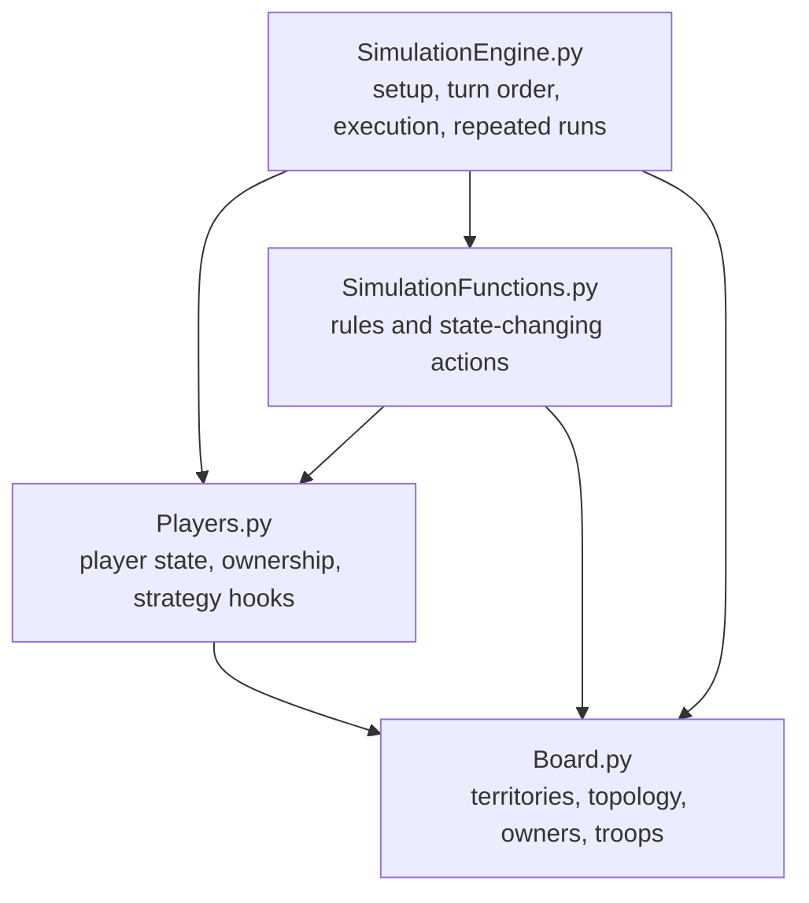
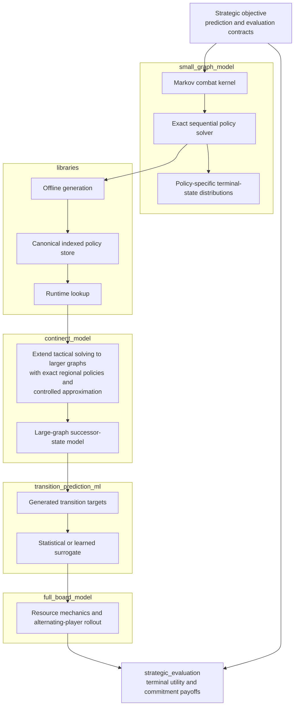
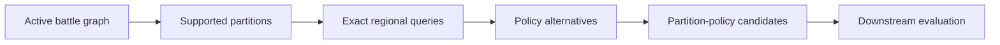
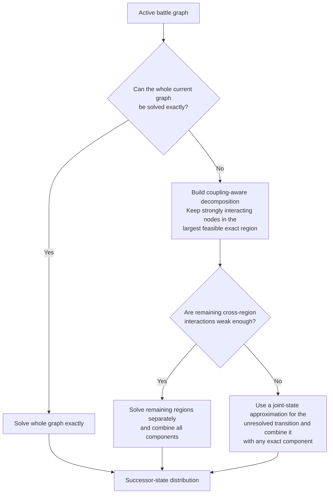

# Project Architecture

Project Risk is a layered modelling system for evaluating stochastic decisions
on graphs. The reusable research implementation is published under
`src/project_risk/`.

This document is the technical counterpart to
[`modelling_approach.md`](modelling_approach.md). It follows the same modelling
pipeline:

```text
[Strategic goals] → [Small graphs] → [Policy libraries] → [Large graphs] → [Transition approximation] → [Multi-turn model] → [Strategic evaluation]
```

The order describes architectural responsibility, not a claim that every layer
currently forms one integrated production runtime. The repository also preserves
an earlier explicit game simulator. That simulator shares board and player
concepts with the mathematical pipeline but remains a separate execution
architecture.

---

## 1. System boundaries and state representations

### 1.1 Original explicit game simulator

The original simulation platform is under
`src/project_risk/game_simulation/`. It models mutable territories, players,
rules, turns, combat, reinforcement and movement.

Its principal dependency structure is:



The modules have distinct responsibilities:

- `Board.py` defines `Territory` objects and the board topology. Territory
  objects carry ownership and troop state.
- `Players.py` defines `Player` objects, owned territories and early attacking,
  defending and expansion strategy hooks.
- `SimulationFunctions.py` implements rules and state transitions, including
  troop placement, reinforcement, combat, ownership changes, movement and
  continent updates.
- `SimulationEngine.py` orchestrates setup, player turns, termination and
  repeated simulations by composing the other three modules.

This source is historical but reusable. A complete public game run is not
claimed as fully validated because the archived engine and rule-helper
interfaces retain some development drift.

Most importantly, no completed adapter installs the later mathematical strategy
pipeline as a `Player` policy inside `SimulationEngine`.

### 1.2 Mathematical strategy pipeline

The later research system uses a different state and execution route. Its main
state representation is `small_graph_outcome_probabilities.GlobalState`, which
stores ownership and troop arrays together with the graph context required by
the mathematical models.

Some continent battle-graph builders temporarily synchronize information with
the mutable `Board` representation. This is a compatibility boundary for graph
construction; it does not make `SimulationEngine` the mathematical turn engine.

The mathematical architecture is:



The strongest implemented path is not identical to this desired end-to-end
flow. Exact solving and library generation are mature; the library-backed
regional route is the most complete production-like large-graph implementation;
the target exact-first routing, corrected learned surrogate and particle
full-board route are not yet connected as one runtime.

### 1.3 Three graph scales

Three graph scales recur in the source and should not be conflated.

1. A **small graph** is a local tactical combat graph handled by
   `small_graph_model` and solved exactly when supported.
2. A **continent / large battle graph** is a larger active combat structure
   handled by `continent_model`. In some transition code, a variable named
   `full_graph` means the complete context for one continent transition, not the
   42-territory world.
3. The **full board** spans continents and alternating player turns. It adds
   reinforcement, redistribution, fortification, shared frontiers, competing
   objectives and multi-turn coordination.

The active battle graph is the boundary between the board-scale context and
tactical calculation. It normalizes players to attacker and defender roles while
retaining topology, ownership, troop counts and a mapping back to the larger
state.

---

## 2. Strategic objective and interface contracts

The architecture distinguishes transition generation from outcome evaluation.

The transition contract is:

$$
P(S' \mid S, \pi),
$$

where $S$ is the current state, $\pi$ is a tactical or strategic policy and
$S'$ is a concrete successor state.

The evaluation contract is:

$$
U(S'),
$$

which scores a compatible outcome independently of the mechanism that produced
it.

This separation is implemented at several levels.

- The small-graph solver uses a context-independent local objective so its
  results can be reused.
- Large-graph layers retain concrete successor distributions so later context
  can distinguish locally tied policies.
- The full-board layer chains transitions while managing player and resource
  mechanics.
- The strategic-evaluation layer applies terminal utility and compares
  commitment profiles.

The architectural interface between layers is therefore not merely a scalar
value. Wherever downstream actions depend on node identity, troop placement or
joint stochastic outcomes, the interface must preserve a distribution over
concrete states.

---

## 3. Small-graph model

The small-graph layer is the exact tactical core. It combines a stochastic
node-to-node combat kernel with sequential policy optimization over a finite
combat graph.

### 3.1 Elementary combat kernel

The lowest stochastic component is implemented primarily in
`markov_matrix_probabilities.py`.

Under a fixed combat policy, one attacker-controlled node and one
defender-controlled node form a finite absorbing Markov chain. With the
transition matrix in canonical form,

$$
P =
\begin{bmatrix}
Q & R \\
0 & I
\end{bmatrix},
$$

the fundamental matrix and absorption probabilities are

$$
N = (I - Q)^{-1},
\qquad
F = NR.
$$

A row of $F$ gives the complete probability distribution over terminal troop
configurations for the battle.

The combat kernel answers:

> What may happen if this battle is fought?

It intentionally does not decide which battle should be selected. Combat is
assumed to continue until the defender is eliminated or the attacker can no
longer continue, using the maximum number of dice permitted by the model. These
assumptions reduce the elementary action space; they are not a claim about
globally optimal full-board behaviour.

### 3.2 Sequential exact policy solving

When several hostile edges are available, attack selection becomes a sequential
decision problem.

`small_graph_outcome_probabilities.py` is the semantic and reference module. It
defines shared structures such as `GlobalState`, `NodeState` and `PolicyOption`,
along with state encoding, local-value comparison and the older recursive exact
behaviour retained for reference and compatibility.

`exact_finite_solver.py` imports those shared definitions and implements the same
whole-battle small-graph model with compact integer states, topology-level shared
caches, precomputed combat rows and separate value/distribution passes.
`create_library.py` uses `CompactExactTopologySolver` for the current
exact-finite library builder.

The two files are therefore **not successive mathematical stages**. The compact
solver supersedes the per-row recursive solver for practical exact computation,
while relying on the state and model semantics defined by the reference module.

For each reachable state, the solver:

1. identifies legal attacks;
2. obtains the complete combat distribution for each attack;
3. constructs successor graph states;
4. evaluates future optimal actions;
5. propagates terminal values backwards; and
6. retains the optimal policy or tied policy alternatives.

The recursion is Bellman-like:

$$
V(s) =
\max_{a \in A(s)}
\sum_{s'} P(s' \mid s, a) V(s').
$$

Many battle sequences arrive at the same ownership-and-troop configuration.
The reachable process is therefore represented as a finite state DAG rather than
a fully duplicated game tree. Memoization and shared caches solve repeated
continuations once.

The local objective is normally lexicographic:

$$
\left(
E[\text{new territories}],
E[\text{final attacker troops}],
P(\text{local conquest})
\right).
$$

The output consists of both an optimal value and a joint probability
distribution over concrete terminal graph states.

### 3.3 Policy representation

Several policy representations coexist because equal local values do not imply
equal successor distributions.

#### Single canonical policy

A deterministic reference continuation selects one stable optimal action at
each state. This is sufficient when only one local value or reference solution
is required.

#### Root policy alternatives

Later implementations retained different optimal actions at the initial state,
each with its own terminal distribution.

#### `state_set` alternatives

Root alternatives are not sufficient when two complete policies share the same
opening action but differ after a later stochastic outcome. `state_set`
representations retain alternatives that diverge deeper in the reachable state
graph.

#### Exact policy DAG

`exact_policy_dag.py` exposes tied optimal choices at several depths and is used
mainly for validation and policy-identity research. It makes explicit that

$$
V(\pi_1) = V(\pi_2)
$$

does not imply

$$
P(S' \mid \pi_1) = P(S' \mid \pi_2).
$$

This distinction affects library payloads, regional policy composition and
training-label semantics.

### 3.4 Troop-count scaling

High troop counts on a fixed small topology were initially handled through
plateau extrapolation. The hypothesis was that optimal policies might stabilize
above some troop threshold, allowing lower-count solutions to be reused.

Stable action availability did not guarantee a stable full policy. Topology,
post-conquest movement, newly opened fronts and later stochastic outcomes could
change the optimal continuation even when an opening action appeared stable.

The plateau architecture predates the practical use of memoization and dynamic
programming for this problem. The later compact solver introduced reusable state
caches, compact encoding, precomputed graph and combat information, and a
separation between value solving and terminal-distribution reconstruction.

The resulting architecture is:

```text
[Explicit recursion] → [Plateau approximation] → [Memoized dynamic programming] → [Compact exact solver] → [Direct exact troop-cap support]
```

`create_library.py` and `library_io.py` retain limited historical plateau and
format-compatibility paths, but direct exact construction is the preferred
small-graph route.

---

## 4. Exact policy libraries

The library layer amortizes the cost of exact small-graph optimization. It is
the principal interface between exact local solving and repeated use inside the
large-graph model.

The library concept predates `exact_finite_solver.py`. Earlier libraries were
built from earlier small-graph implementations; improved solvers later expanded
topology coverage, troop caps and policy richness without changing the basic
precompute-and-query architecture.

### 4.1 Role-preserving canonicalization

Differently labelled graphs may represent the same tactical problem. The system
therefore canonicalizes graphs under permutations that preserve attacker and
defender roles.

```text
[Labelled graph] → [Role-preserving relabellings] → [Canonical topology + mapping] → [Solve or query once]
```

The canonical topology becomes the library identity. The canonical-to-global
mapping is retained so retrieved policies and successor states can be interpreted
in the original larger graph.

Canonicalization:

- reduces duplicate exact calculation;
- creates stable graph-library identities;
- allows reuse across concrete board labels; and
- forms a compatibility contract between library construction and runtime
  lookup.

Changing its semantics therefore requires coordinated changes to generated
libraries and their consumers.

### 4.2 Offline generation

`create_library.py` is the central library builder.

For a supported attacker/defender pattern and troop cap, it:

```text
[Enumerate topologies] → [Canonicalize] → [Generate troop rows] → [Solve exactly] → [Retain policy distributions] → [Write indexes and chunks]
```

For one canonical topology, a `CompactExactTopologySolver` can reuse its
dynamic-programming caches across many initial troop configurations. The
approximate number of initial rows for a topology is

$$
\mathrm{maxA}^{n_A} \mathrm{maxD}^{n_D}.
$$

Graph topology adds a separate combinatorial dimension. Parallel generation is
therefore performed mainly across topologies so each worker can retain the value
of its local solver cache.

### 4.3 Policy-aware row representation

The library is not a cache of scalar values. A row can contain one or more
policy-specific terminal distributions.

Later V2 payloads use aligned numerical arrays describing:

- outcome probabilities;
- terminal owners;
- terminal troop counts;
- cumulative probabilities for sampling;
- newly conquered territories;
- final attacker troops; and
- local conquest indicators.

For probabilities $p = (p_1, \ldots, p_k)$, expected derived values can be
calculated directly, for example

$$
E[\text{new territories}] = \sum_i p_i n_i.
$$

Multiple tied policies can be stored under one initial state while each remains
independently sampleable and retains its own joint successor distribution.

Earlier matrices, DataFrames, dictionaries and labelled outcome structures were
more verbose. Compact aligned payloads shifted the main bottleneck from exact
calculation toward representation, storage and lookup.

### 4.4 Chunked storage and indexed lookup

Millions of solved rows cannot be loaded efficiently as one Python object. The
current format separates a graph-level index from row chunks:

```text
graph library
│
├── canonical topology and graph metadata
├── build and policy metadata
├── row → chunk index
│
└── row chunks
     ├── chunk_000000
     ├── chunk_000001
     └── ...
```

`library_io.py` is the format-aware data boundary. It resolves the graph
descriptor, locates the requested row, loads the correct chunk and normalizes
single-policy and multi-policy payloads to one downstream interface.

`ChunkCache` and the higher-level regional query cache reduce repeated disk
access during ranking operations.

One recorded `2A3D` build covered 98 canonical topologies and 1,647,086 troop
configurations. At the inspected research snapshot, the principal library
directories together occupied roughly 19 GiB. These generated artifacts are not
part of the public repository.

### 4.5 Runtime lookup

The runtime route is separate from offline generation:

```text
[Large-state region] → [Normalize A / D] → [Prune] → [Select library] → [Canonicalize + map] → [Load row chunk] → [Recover policies] → [Map outcomes back]
```

`approximate_graph_outcome_probabilities.py` is the principal domain-to-library
adapter. It extracts candidate regions, normalizes roles, retains node mappings
and issues the library queries consumed by large-graph ranking.

`create_library.py` does not sit on this runtime lookup path. It produces the
artifacts that `library_io.py` later consumes.

### 4.6 Restricted graph families

Coverage depends on topology as well as node count. Some attacker/defender count
patterns are expensive to enumerate generally even though restricted structures
within them are tractable.

Star-topology libraries extend exact coverage for such special cases. Their
constrained edge structure avoids enumerating every topology of the same size.
These libraries support both runtime edge cases and broader training-data
coverage for unbalanced attacker/defender configurations.

---

## 5. Continent / large-graph model

The large-graph layer addresses growth in the number of interacting nodes. The
current implemented path is library-backed regional decomposition. Validation
supports a later exact-first, coupling-aware router, but that router has not
replaced the production path.

The central implemented modules are:

- `approximate_graph_outcome_probabilities.py`; and
- `battle_graph_ranking.py`.

### 5.1 From a larger state to an active battle graph

Most tactical calculations do not require every full-board node. The system
extracts an active battle graph containing attacker- and defender-controlled
nodes participating in the current combat process.

The graph retains:

- topology;
- normalized attacker/defender ownership;
- troop counts; and
- mappings to the original larger-state nodes.

This mapping allows canonical local outcomes to be translated back into
concrete state transitions.

### 5.2 Use the largest exact regions available

For graphs beyond one supported library region,
`partition_continent_battle_graph_into_valid_small_graphs()` generates connected,
disjoint regions subject to attacker/defender composition, topology and available
library coverage. Each region is canonicalized and queried through
`approximate_graph_outcome_probabilities.py`.



`filter_maximal_supported_partitions()` implements the preference for larger
exact-supported regions. Its `is_strict_exact_coarsening()` rule treats a finer
partition as dominated when:

1. both partitions cover the same node universe;
2. the coarser partition contains fewer regions; and
3. every region in the finer partition is contained in a region of the coarser
   partition.

The default `maximal_per_partition_utility` candidate-preparation mode removes
such dominated fine partitions before comparing local utility. This keeps more
interaction inside each exact library query. It is a rule within the current
library-supported regional model; it is not yet the broader runtime exact-region
selection proposed by the exact-first target architecture.

Each retained region can expose multiple locally tied policy distributions.
`expand_partition_policy_candidates()` constructs combinations over both
partition identity and policy identity. Equal local utility does not make two
policies interchangeable when their concrete successor distributions create
different next-wave opportunities.

### 5.3 The main approximation comes from splitting the graph

Every selected region can have an exact library-backed policy distribution. The
large-graph result is nevertheless approximate when the partition treats those
regional processes as separate.

The technical distinction is:

- **decomposition** chooses to model the regions separately; and
- **composition** combines their successor distributions after that assumption
  has been made.

If no action or outcome in one region can affect the legal actions or optimal
continuation in another, the regional distributions can be combined directly.
The validation helper `compose_selected_candidate_distribution_exact()` computes
that product distribution without Monte Carlo error.

If regions interact, decomposition has already removed dependence. Cross-region
effects include newly opened attack sequences, outcome-dependent stopping,
different surviving troop locations and changes in the next optimal action. An
exact calculation of the factorized product is exact only for the assumed
independent-regions model, not necessarily for the original large graph.

### 5.4 Second-wave Monte Carlo and re-partitioning

The implemented look-ahead evaluates how first-wave outcomes change the next
tactical situation. `_monte_carlo_lookahead_for_partition()` obtains the
policy-specific regional distributions, samples one concrete outcome per region,
overlays them into a new `GlobalState`, synchronizes the compatible board state
and reruns the regional ranking path for the successor.

```text
[Regional policy candidate] → [Sample outcomes] → [Assemble successor state] → [Re-evaluate graph] → [Repartition] → [Score next wave]
```

The next partition is generated under the sampled successor state, so region
boundaries can change after a conquest. Monte Carlo repetition estimates the
downstream value of the original partition-policy candidate.

This look-ahead can capture interactions that become visible after the sampled
first wave. It cannot reconstruct a dependency already discarded by the initial
partition. Second-wave Monte Carlo is therefore a downstream evaluator, not a
proof that the original decomposition was valid.

### 5.5 What validation showed

The retained validation compares an approximate successor-state distribution
$P$ with a full exact reference distribution $Q$ using total variation distance:

$$
\mathrm{TV}(P, Q) = \frac{1}{2}\sum_s \lvert P(s) - Q(s) \rvert.
$$

$\mathrm{TV}=0$ means identical distributions; values closer to $1$ indicate
increasingly different distributions.

| Question tested | What was observed | Architectural implication |
| --- | --- | --- |
| Can current states outside normal library coverage sometimes be solved exactly? | $360/360$ deterministic cases completed; worst runtime $0.783527\,\mathrm{s}$. | Library generation coverage is not the runtime boundary for one exact state. |
| Is Monte Carlo required to combine regional distributions after assuming independence? | Direct composition took $0.000496\,\mathrm{s}$; $10{,}000$ samples took $4.008617\,\mathrm{s}$ and had TV error $0.003499$. | Direct composition is faster and exact for the assumed factorized model. |
| How accurate is splitting under weak interaction? | Nine bridge cases had mean TV $0.006117$. | Regional decomposition can closely match the full exact distribution when coupling is weak. |
| What happens under strong interaction? | Ten double-front cases had mean TV $0.797696$. | Splitting can remove essential sequence dependence. |
| Can more exact regional candidate selection repair decomposition? | The selected candidate changed in $15/50$ cases; all seven earlier $\mathrm{TV}=1$ failures remained. | Ranking cannot restore dependencies already removed by the split. |
| Are equal-valued policies interchangeable? | Tied local policies produced materially different successor distributions. | Policy identity must survive when downstream state differences matter. |

A broader 315-cell exact-tractability expansion completed 311 cells under a
ten-second stop. The remaining difficult cells reached the runtime safeguard;
the result supports bounded exact attempts with fallback, not one unconditional
new exact boundary. Detailed conditions and provenance remain in
[`validation.md`](validation.md).

### 5.6 Current implemented route

Offline library generation and runtime consumption are distinct:

```text
OFFLINE: [Shared small-graph semantics + compact exact solver] → [create_library.py] → [Generated policy libraries]
```

```text
RUNTIME: [Active battle graph] → [approximate_graph_outcome_probabilities.py] → [library_io.py] → [battle_graph_ranking.py] → [Selected regional successor model]
```

The runtime path enumerates library-supported regions, filters dominated fine
partitions, retains relevant policy alternatives and optionally performs
second-wave look-ahead. It does not first attempt a full exact solve of every
current active battle graph.

### 5.7 Exact-first target architecture

Library construction and one-off runtime solving have different costs. A library
must cover many canonical topologies, troop configurations and initial rows. A
runtime exact attempt needs only the current topology and state. The validated
tractability results therefore show that absence from the precomputed library is
not, by itself, evidence that one exact solve is infeasible.

The target architecture would:

1. attempt the whole current active graph under empirical runtime/state limits;
2. if that fails, build a coupling-aware decomposition that keeps strongly
   interacting nodes in the largest exact calculation feasible;
3. continue to model every node outside that exact region;
4. use separate regional policies only where the remaining cross-region
   interaction is weak enough; and
5. use a joint-state approximation for unresolved strongly dependent structure.



The larger exact region has no direct edge to the final distribution because it
does not account for excluded nodes by itself. It is one component of the
coupling-aware decomposition and must be combined with the model for the rest of
the graph.

This is a **target architecture**, not current production behaviour.
`build_exact_first_routing_analysis()` records `production_routing_changed` as
false, and the recommendation helpers live under validation rather than the
runtime `continent_model` path. A general automatic rule for selecting the
smallest sufficient coupled region remains open.

---

## 6. Transition prediction and machine learning

The transition-prediction layer is a surrogate branch of the expensive
large-graph process. Its target is approximately

$$
P(S' \mid S, \text{active-player transition or policy}).
$$

It primarily models one continent-scale active-player combat transition. The
separate `full_board_model` layer chains those transitions across players and
applies full-board resource mechanics.

### 6.1 Data-generation dependency

The principal dependency is:

```text
[Large-graph state] → [generate_data_ML.py] → [battle_graph_ranking.py] → [Regional queries + libraries] → [Selected successor distribution] → [Training target]
```

The learned model does not bypass the underlying graph and combat semantics. It
learns from targets produced by a particular version of the strategy pipeline.
The validity of that target generator is therefore part of the model's validity.

### 6.2 Macro statistical surrogate

The earliest surrogate compressed large states into strategic descriptors such
as:

- troop and territory balance;
- troop concentration;
- graph topology;
- active-force deployment; and
- reserves and distance to the battle front.

Regression, GLMs and spline-based GAMs captured broad outcome relationships.
Their architectural limitation was the output representation: a conditional
expectation over compressed descriptors could not reconstruct a concrete legal
successor state for recursive simulation.

The feature engineering and simulation-to-data infrastructure remained useful
for later models.

### 6.3 Node-level Random Forest surrogate

The next route generated concrete `GlobalState` successors and converted them
into node-level labels. Global statistical descriptors were combined with local
features such as initial owner, troop count, neighbouring ownership and frontier
position.

`train_ML.py` trained Random Forest classifiers and regressors. Historical
continent-specific models achieved strong predictive metrics relative to their
labels.

Those labels inherited weaknesses from the generator version used at the time:

- older small-graph objectives;
- plateau approximation at higher troop counts;
- unvalidated regional decomposition;
- incomplete coverage of unbalanced attacker/defender patterns; and
- row-level evaluation splits that could overstate scenario-level
  generalization.

The model therefore demonstrated high predictive agreement with generated
targets, while the strategic validity of those targets remained uncertain.

`predict_future_states_ML.py` contains reusable transition glue and a retained
legacy continent-scoped multi-turn helper.

### 6.4 Joint successor-state model

Independent node marginals can combine outcomes from mutually exclusive paths
and therefore fail to represent one legal board. Later work moved toward complete
successor signatures.

`transition_distribution_ML.py` contains the experimental joint-state
retrieval/KNN training and inference implementation. Complete signatures retain
correlated ownership and troop outcomes because all nodes come from one realized
transition.

`transition_distribution_stage_a_v2.py` and
`transition_distribution_stage_a_v3.py` construct and calibrate one-transition
target distributions. They are target-generation infrastructure, not deployed
inference models.

The intended future dependency is:

```text
[Validated large-graph generator] → [Policy-aware joint-state targets] → [Joint-state surrogate] → [Coherent transition distribution]
```

The surrogate should be rebuilt only after exact routing, coupled-region logic
and tied-policy target semantics are sufficiently stable.

---

## 7. Full-board multi-turn model

The mathematical full-board layer is under
`src/project_risk/mathematical/full_board_model/`.

A one-transition continent model primarily describes active combat. A complete
turn also requires:

- reinforcement allocation;
- troop redistribution and fortification;
- competing continent objectives;
- shared frontier nodes;
- alternating player perspectives; and
- resource coupling between simultaneous strategic commitments.

These mechanics form a separate approximation and orchestration layer around
the learned or otherwise generated combat transition.

### 7.1 State and orchestration boundary

The main mathematical state is `GlobalState`. Some graph builders temporarily
synchronize a compatible mutable `Board`, but mathematical rollouts do not
delegate turns to `SimulationEngine`.

Principal modules include:

- `full_board_state_generators.py`;
- `full_board_simulation_GT.py`;
- `full_board_simulation_ML.py`; and
- `strategy_policy_gt.py`.

`strategy_policy_gt.py` supplies experimental commitment, reinforcement split,
shared-frontier and fortification mechanics.

### 7.2 Historical RF-based rollout

The first operational multi-turn route used historical node-level Random Forest
transitions. It demonstrated the architecture:

```text
[State at turn t] → [Active-player transition] → [Resource + board update] → [Next-player perspective] → [State at turn t+1]
```

This route inherited the target-generator and node-independence limitations of
the RF model. Repeated rollout can accumulate rather than remove those errors.

`full_board_simulation_GT.py` currently uses this older learned transition
route. Despite its name, it is a commitment-conditioned cross-scale rollout, not
a general game-theory or equilibrium solver.

### 7.3 Joint-state particle direction

`full_board_simulation_ML.py` retains both a historical deterministic
node-marginal route and a later joint-state particle route.

The particle architecture maintains a bounded collection of coherent board
states, samples or weights successors, merges equivalent states where useful
and continues through alternating turns. It propagates uncertainty as a
distribution over complete boards instead of collapsing it into independent
expected node values.

This route remains experimental because its transition targets depend on the
large-graph generator currently being revised.

### 7.4 Current integration gap

The full-board layer contains two generations:

1. an RF-based architectural prototype; and
2. a joint-state particle direction intended to replace independent node
   propagation.

Neither is connected end to end to the target exact-first large-graph routing.
The intended development sequence is:

```text
[Validate large-graph generator] → [Define tied-policy targets] → [Rebuild joint-state surrogate] → [Integrate particle rollout]
```

The optional `demo/visualization/SimulationRenderGT.py` only renders compatible
states; it is not part of the transition or strategy logic.

---

## 8. Strategic evaluation

Strategic evaluation consumes terminal or horizon states produced by compatible
upstream routes.

### 8.1 Terminal utility

`utility_terminal.py` provides reusable global outcome scoring. Its architectural
role is independent of transition generation: a compatible state may come from
an exact solve, regional approximation, learned transition or multi-turn
rollout.

This boundary keeps prediction and evaluation separate.

### 8.2 Commitment profiles and payoff tables

`game_theory_commitment.py` enumerates higher-level commitment profiles and
invokes the GT rollout to construct payoffs:

```text
[Commitment profile] → [Full-board rollout] → [Terminal or horizon state] → [utility_terminal.py] → [Payoff table]
```

The module compares the strategic consequences of commitment combinations. It
does not currently compute or select a Nash equilibrium and does not replace the
tactical policy optimization performed by lower layers.

---

## 9. Cross-layer validation architecture

Validation is organized by model boundary rather than treated as one final
system test. Correctness within one layer does not guarantee that its output is
sufficient for the next.

### 9.1 Combat kernel

Tests check probability tables, terminal outcomes and normalization.

### 9.2 Exact finite solver

The compact solver is compared with the older semantic/reference recursion for
values, policies and successor distributions.

### 9.3 Policy identity

`exact_policy_dag.py` and related experiments test whether tied policy choices
retain value while changing labelled successor distributions.

### 9.4 Library construction and lookup

Small isolated libraries are built and checked for row coverage, schema
consistency, probability mass and agreement with direct exact calculation.

Relevant components include:

- `validate_exact_finite_library_builder.py`;
- `check_exact_finite_library_contents.py`; and
- `verify_state_set_cap7_full_library.py`.

### 9.5 Regional decomposition

`regional_compounding_validation.py` and
`regional_compounding_validation_v2.py` compare library-backed regional
approximations with full exact reference distributions.

These tests revealed the difference between weakly coupled bridge cases and
strongly coupled double-front cases, motivating the exact-first target
direction.

### 9.6 Training pipeline

`preflight_checks_training.py` verifies library coverage and selected artifacts
before expensive data generation or training.

Future learned-transition evaluation should use grouped scenario-level splits,
complete successor-distribution metrics and multi-turn error propagation, not
only marginal node accuracy.

The core validation principle is:

> **An exact component can still participate in an invalid higher-level
> representation.**

An exact regional policy does not validate decomposition; a predictive model
that accurately reproduces labels does not validate the process that generated
those labels.

---

## 10. Current implementation status and module map

| Layer | Principal modules | Role and status |
|---|---|---|
| Original explicit simulator | `Board.py`, `Players.py`, `SimulationFunctions.py`, `SimulationEngine.py` | Mutable historical game platform; separate from mathematical rollout. |
| Combat probability | `markov_matrix_probabilities.py` | Mature whole-battle stochastic transition kernel. |
| Small-graph semantics | `small_graph_outcome_probabilities.py` | Defines local states, actions, terminal conditions, utilities and reference behaviour. |
| Compact exact solving | `exact_finite_solver.py` | Mature finite-state dynamic programming for canonical topologies. |
| Policy structure | `exact_policy_dag.py` | Validation and research representation of tied optimal policy structure. |
| Library generation | `create_library.py` | Offline enumeration and construction of exact policy artifacts. |
| Library data boundary | `library_io.py` | Indexed chunk lookup and policy-payload normalization at runtime. |
| Board/region adaptation | `approximate_graph_outcome_probabilities.py` | Extracts supported regions, normalizes roles, selects library coverage and maps outcomes. |
| Large-graph ranking | `battle_graph_ranking.py` | Ranks partition-policy combinations and performs second-wave evaluation. |
| Exact-first routing analysis | `regional_compounding_validation_v2.py` | Recommends later exact-first routing while explicitly leaving production routing unchanged. |
| Transition data generation | `generate_data_ML.py` | Produces supervised targets from the strategy pipeline. |
| Historical node ML | `train_ML.py`, `predict_future_states_ML.py` | Learned node marginals from historical generated states. |
| Joint-state ML | `transition_distribution_ML.py` | Experimental KNN inference over complete successor signatures. |
| Joint-state target infrastructure | `transition_distribution_stage_a_v2.py`, `transition_distribution_stage_a_v3.py` | Constructs and calibrates one-transition targets; not inference. |
| Mathematical full-board model | `full_board_state_generators.py`, `full_board_simulation_GT.py`, `full_board_simulation_ML.py`, `strategy_policy_gt.py` | Historical RF rollout and experimental particle route. |
| Strategic evaluation | `utility_terminal.py`, `game_theory_commitment.py` | Terminal scoring and commitment payoff construction; no equilibrium solver. |
| Regional validation | `regional_compounding_validation.py`, `regional_compounding_validation_v2.py` | Measures decomposition error against full exact references. |
| Distribution metrics | `distribution_comparison_metrics.py` | Measures distributional agreement, including total variation. |
| Training preflight | `preflight_checks_training.py` | Checks coverage and artifacts before expensive target generation. |

The table maps source modules to architectural responsibilities. It does not
imply that every historical and experimental component is active in one
runtime.

---

## 11. Public repository boundary

The public repository contains reusable source for the documented research
layers under `src/project_risk/`.

The compact runnable example under `examples/run_exact_example.py` imports the
actual research implementation and demonstrates:

```text
[Combat kernel] → [Small-graph state] → [Exact solver] → [Optimal and tied policies] → [Terminal-state distribution]
```

The example deliberately does not require generated multi-gigabyte policy
libraries, trained models, full-board rollouts or historical data products.
Artifact-dependent research paths are inspectable but require their external
inputs only when invoked.

The source and demo have different responsibilities:

> `src/project_risk/` contains the reusable research implementation; the demo is
> a small orchestration layer that runs one exact component from a clean
> checkout.

The broader architecture described here represents the complete research
system, including implemented, historical and explicitly experimental layers.
