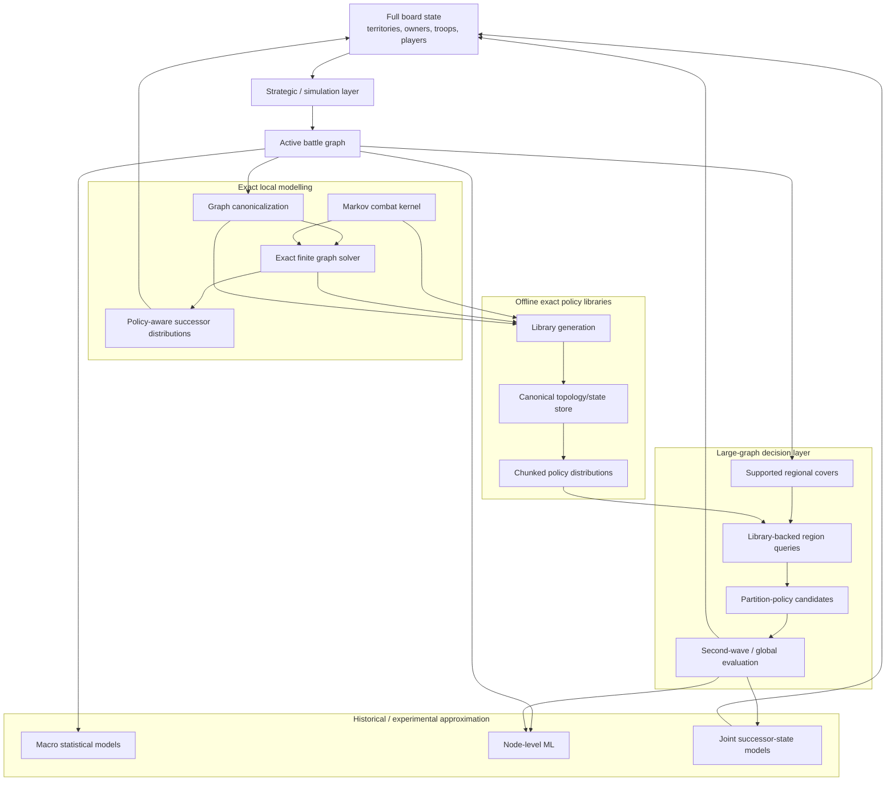
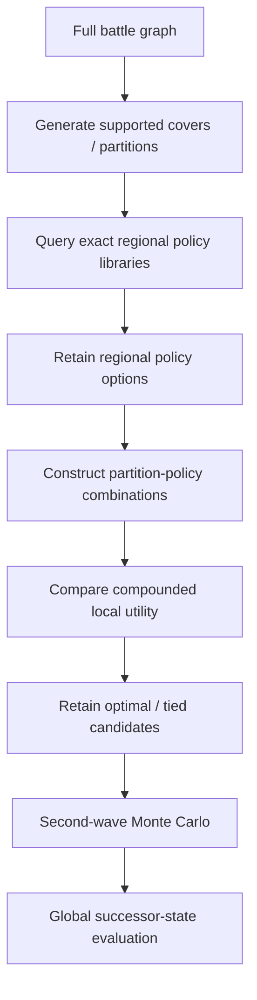
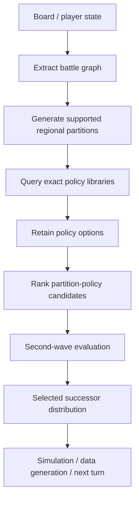
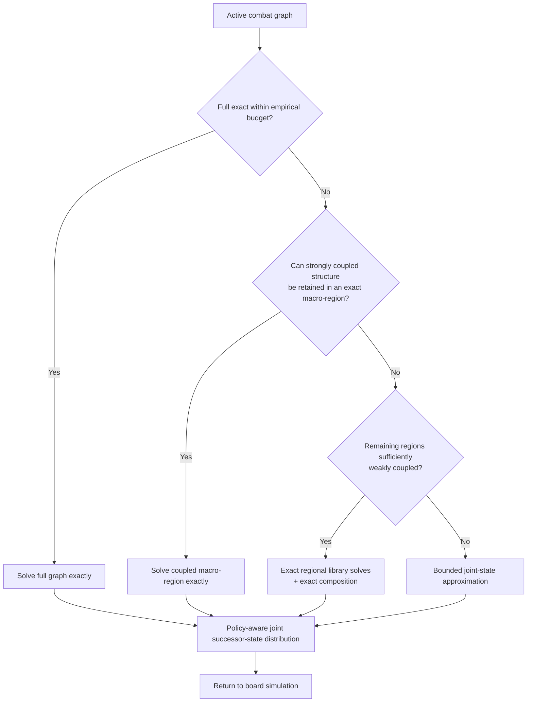

# Project Architecture

Project Risk has grown into a layered modelling system for evaluating stochastic
decisions on graphs.

The reusable research implementation is published under `src/project_risk/`.
The small exact example is an orchestration entry point under `examples/` that
imports this implementation directly, so one mathematical component can be
reproduced without generated policy libraries or trained models and without a
duplicate compatibility package.

At the system level, Project Risk connects five main functions:

1. representing and simulating the board;
2. modelling elementary stochastic combat;
3. solving tactical decisions exactly where possible;
4. storing exact local policies for repeated use;
5. combining, approximating and evaluating those policies on larger graphs.

Several statistical and machine-learning approaches have also occupied the
large-graph transition layer at different stages of the project.

The resulting architecture contains two high-level systems: the original
explicit game simulator and the later mathematical strategy pipeline. They
share board/topology concepts, but no completed adapter installs the advanced
mathematical strategy as a player policy in the original engine.

---

## 1. System overview

A simplified view of the research system is:



Not every branch in this diagram forms one currently integrated production
pipeline.

The strongest implemented large-graph route is the library-backed regional
system. The exact finite solver is central to that route **offline**, because it
generates the policy libraries, but the runtime regional query normally retrieves
precomputed policies rather than solving each region again.

The later exact-first architecture changes that routing assumption and is
described separately below.

### Three graph scales

The architecture uses three graph scales that should not be conflated:

- A **small graph** is a local tactical combat graph solved exactly by
  `markov_matrix_probabilities.py`, `small_graph_outcome_probabilities.py`, and
  `exact_finite_solver.py`.
- A **continent / large battle graph** is a larger active combat structure,
  often roughly continent-scale, handled by
  `approximate_graph_outcome_probabilities.py` and `battle_graph_ranking.py`.
  In transition-data code, a variable named `full_graph` often means the full
  context graph for one continent transition, not the 42-territory world.
- The **full board** spans continents and alternating player turns. It adds
  reinforcement allocation, troop redistribution, fortification, competing
  objectives, shared frontiers, and multi-turn coordination; it is not merely
  a larger tactical graph.

---

## 2. Original simulation and mathematical full-board layers

The project began with a general Risk simulation platform built in Python. Its
public source is under `src/project_risk/game_simulation/` and includes the
mutable `Board`, `Players`, rules helpers and `SimulationEngine` orchestration.

The board is represented as a graph. A territory is a node containing information
such as ownership, troop count and neighbouring territories. Continents are
collections of territories defined by the board topology.

Player objects represent agents acting on the board. They maintain ownership,
perform actions and can be equipped with different strategy or behaviour rules.

At the full-board level, a game state is therefore essentially:

\[
S =
\{
(\text{territory},\text{owner},\text{troops})
\}_{1}^{N},
\]

together with the static graph structure and the relevant player state.

The simulation progresses through state transitions:

\[
S_t
\rightarrow
a_t
\rightarrow
S_{t+1}.
\]

Some actions have deterministic consequences while combat introduces stochastic
transitions.

The broader simulation infrastructure provides the environment in which tactical
policies can eventually be evaluated. It is also the source of states used for
Monte Carlo experiments, statistical modelling and machine-learning data
generation.

The later mathematical full-board routes are separate. They use
`small_graph_outcome_probabilities.GlobalState` as their principal state and
temporarily synchronize the mutable Board when continent battle-graph builders
need it. They do not use `SimulationEngine` as their turn engine.

Relevant mathematical components include:

- `full_board_simulation_GT.py`
- `full_board_simulation_ML.py`

`full_board_simulation_GT.py` currently uses the older node-level learned
transition route. `full_board_simulation_ML.py` contains both a historical
deterministic node-marginal rollout and a later joint-state particle rollout.
Neither currently implements the latest exact-first route end to end.

Despite its name, `full_board_simulation_GT.py` is a commitment-conditioned
cross-scale rollout, not a general game-theory or equilibrium solver.
`strategy_policy_gt.py` supplies experimental commitment, reinforcement split,
shared-frontier and fortification mechanics. The optional
`demo/visualization/SimulationRenderGT.py` only renders compatible states.

Strategic evaluation is downstream of state generation. `utility_terminal.py`
is current reusable terminal/global outcome scoring that can consume compatible
states from any producer. `game_theory_commitment.py` is active experimental
profile enumeration: it invokes the GT rollout and builds payoff tables, but it
does not solve or select a Nash equilibrium.

---

## 3. From the full board to an active battle graph

Most tactical calculations do not require the entire Risk board.

When combat is being considered, the relevant ownership boundary can be
represented as an **active battle graph** containing attacker- and
defender-controlled nodes participating in the immediate tactical problem.

This reduction is important because the complete board may contain many nodes
that cannot affect the current sequence of attacks.

The battle graph becomes the main interface between the global simulation and
the tactical modelling system.

At this level the nodes are normalized to combat roles:

- `A` — attacker-owned;
- `D` — defender-owned.

The graph retains:

- topology;
- ownership;
- troop counts;
- mapping back to the original board nodes.

This mapping is critical. Tactical computation may operate on local and
canonical node labels, but an action eventually has to be translated back into
a concrete move on the full board.

`approximate_graph_outcome_probabilities.py` has become an important adapter
between these two representations. Among other tasks, it extracts regions,
normalizes ownership roles, constructs canonical local graphs and retains the
mapping from local indices back to global board nodes.

---

## 4. Elementary combat probability layer

The lowest stochastic layer is implemented primarily in:

`markov_matrix_probabilities.py`

It models combat between one attacker-controlled node and one defender-controlled
node as a finite absorbing Markov chain.

For a chosen attack, the higher-level tactical solver does not need to simulate
individual dice rolls. Instead, the combat layer returns the complete probability
distribution over possible terminal outcomes of the battle.

Conceptually:

```text
attacker troops + defender troops
                ↓
       absorbing Markov chain
                ↓
probability distribution over
terminal attacker/defender troops
```

This is the elementary stochastic transition used by every higher combat layer.

Separating combat mechanics from strategic decision-making is important. The
Markov kernel answers:

> What may happen if this battle is fought?

The graph solver answers:

> Which battle should be fought?

---

## 5. Exact tactical modelling on small graphs

Once several hostile edges exist, selecting an attack becomes a sequential
decision problem.

The main semantic implementation is contained in:

`small_graph_outcome_probabilities.py`

with the more computationally efficient exact implementation in:

`exact_finite_solver.py`

A local state contains the ownership and troop count of every node in the combat
graph.

From each state the solver:

1. identifies legal attacks;
2. evaluates the complete Markov distribution for each battle;
3. constructs every reachable successor graph state;
4. evaluates future optimal actions recursively;
5. propagates terminal values backwards;
6. selects the policy or policies with optimal expected utility.

Because the same state may be reached through several battle sequences, the
computation is represented internally as a finite state DAG rather than as a
fully duplicated game tree.

Memoization allows those shared subproblems to be solved once.

The local objective is normally evaluated lexicographically as:

\[
\left(
E[\text{new territories}],
E[\text{final attacker troops}],
P(\text{local conquest})
\right).
\]

This produces two related outputs:

- an optimal value;
- a probability distribution over concrete terminal graph states.

The distinction between them is important for the architecture. Higher layers
generally need the terminal distribution, not merely the value.

---

## 6. Policy representation

The representation of an optimal solution has changed significantly during the
project.

A simple solver can choose one optimal action and discard all alternatives.
That is sufficient if the only downstream object is the local expected value.

Project Risk increasingly required more information.

Two locally equal policies can generate different troop placements and therefore
different future borders. Consequently, several generations of policy
representation were developed.

### Single canonical policy

The simplest representation selects one deterministic optimal continuation.

This remains useful as a stable reference solution.

### Root policy alternatives

Later versions retained multiple optimal choices at the initial decision point.

Each root policy option could therefore have its own successor-state
distribution.

### `state_set` policy alternatives

Root alternatives were eventually found to be insufficient.

Two complete policies may share the same opening action but differ after some
later stochastic outcome.

`state_set` representations therefore allow alternatives to differ in downstream
decision states as well.

### Exact policy DAG

`exact_policy_dag.py` provides a fuller representation of the optimal decision
structure and has mainly been used for validation and research into policy ties.

It makes explicit that:

\[
V(\pi_1)=V(\pi_2)
\]

does not imply

\[
P(S'|\pi_1)=P(S'|\pi_2).
\]

This distinction is important for regional composition, training-data generation
and any later decision stage consuming the distribution.

---

## 7. Canonical graph representation

The exact solver would be far less useful if every labelled version of a graph
had to be solved independently.

A major optimization therefore occurs before policy computation:
**role-preserving graph canonicalization**.

Suppose two local battle graphs have the same topology but different node
labels.

If attacker nodes are permuted only among attacker nodes and defender nodes only
among defender nodes, the underlying tactical problem may be identical.

The system maps equivalent labelled graphs to a canonical topology.

Conceptually:

```text
labelled battle graph
        ↓
all role-preserving relabellings
        ↓
canonical topology
        ↓
solve / library lookup once
```

The mapping between canonical local nodes and original global nodes is retained
so that retrieved policies can later be translated back into the board
simulation.

Canonicalization therefore has several architectural roles:

- reduces the number of graph topologies that require exact computation;
- creates stable identities for library files;
- allows solutions to be reused across differently labelled board positions;
- provides a compatibility contract between library construction and runtime
  lookup.

Because of that final role, canonicalization is not merely an optimization.
Changing its semantics requires coordinated changes to existing libraries and
their consumers.

---

## 8. Offline exact policy-library generation

The exact small-graph solver is connected to the larger model primarily through
the generated policy libraries.

The central generation module is:

`create_library.py`

The underlying idea is amortization.

Instead of repeatedly solving the same tactical problem during game simulation,
the system solves all supported small configurations offline.

For a given attacker/defender node pattern and troop cap, the builder:

```text
enumerates graph topologies
        ↓
canonicalizes equivalent graphs
        ↓
generates troop configurations
        ↓
solves each initial state exactly
        ↓
retains policy-specific terminal distributions
        ↓
serializes the results into the library
```

For each canonical topology, one `CompactExactTopologySolver` can reuse its
dynamic-programming caches across many initial troop configurations.

This is a major computational advantage because nearby initial states share a
large number of reachable successor states.

The expected number of initial rows for one topology is approximately

\[
\text{maxA}^{n_A}\text{maxD}^{n_D}.
\]

The graph topology itself adds another combinatorial dimension, making graph
canonicalization and shared caches essential.

Parallel library construction is performed primarily across topologies rather
than across individual rows so that each worker can retain the value of its local
solver cache.

---

## 9. Evolution of the library representation

The library infrastructure has itself undergone several generations of
development.

This matters because the library is not simply a cache of scalar results. It is
a representation of tactical policy information intended for repeated use by
higher modelling layers.

Earlier implementations relied more heavily on explicit matrices, DataFrames,
verbose dictionaries and labelled outcome structures.

As library coverage expanded, these representations became increasingly
expensive.

The newer V2 representation stores aligned numerical arrays for each successor
distribution.

A typical row contains arrays describing:

- outcome probabilities;
- node owners;
- node troop counts;
- cumulative probabilities for sampling;
- number of newly conquered territories;
- final attacker troop count;
- local conquest indicators.

The probability vector can be viewed schematically as

\[
p=(p_1,\ldots,p_k),
\]

while ownership and troop arrays contain the corresponding concrete terminal
states.

This has several advantages.

The data become more compact, vector operations become cheaper, and downstream
code can calculate expected quantities directly from the stored arrays.

For example,

\[
E[\text{new territories}]
=
\sum_i p_i n_i.
\]

Multiple tied policy alternatives can be stored under the same initial row, with
each option retaining a complete independently sampleable distribution.

---

## 10. Chunked library storage and indexed lookup

As the number of solved states grew into the millions, storing an entire graph
library as one large Python object became impractical.

The current library design therefore separates a small graph-level index from
the actual row data.

A simplified structure is:

```text
graph library
│
├── graph metadata
├── canonical topology
├── build / policy metadata
├── row → chunk index
│
└── row chunks
     ├── chunk_000000
     ├── chunk_000001
     └── ...
```

Each graph-level object tells the runtime reader which chunk contains a requested
troop configuration.

Only that chunk needs to be loaded.

The principal format-aware reader is:

`library_io.py`

It resolves the graph descriptor, finds the requested row, loads the correct
chunk and normalizes single-policy and multi-policy payloads to one downstream
interface.

`ChunkCache` and the higher-level regional query cache reduce repeated disk
access during ranking operations.

This architecture became necessary because the generated libraries grew very
large. At the inspected research snapshot, the principal library directories
together occupied roughly 19 GiB.

The size is a consequence not merely of graph count but of increasing richness
in what is stored: troop configurations, terminal distributions and multiple
policy alternatives.

---

## 11. Runtime policy lookup

The purpose of the exact policy libraries is realized at runtime.

For a region extracted from the board,
`approximate_graph_outcome_probabilities.py` performs the domain-to-library
translation.

The main query path is conceptually:

```text
global board region
        ↓
normalize players → A / D
        ↓
remove irrelevant local nodes
        ↓
determine attacker/defender pattern
        ↓
select sufficient troop-cap library
        ↓
canonicalize local topology
        ↓
retain canonical ↔ global mapping
        ↓
locate graph library
        ↓
encode troop row
        ↓
load row chunk
        ↓
recover one or more policy distributions
```

The runtime policy query is therefore much cheaper than performing the underlying
dynamic programming again.

This is the intended connection between exact computation and the live game
simulation.

The policy returned from the library is still expressed in terms of the
canonical local graph, so the retained node mapping is used to interpret the
result in the original board state.

---

## 12. Large-graph regional architecture

When an active battle graph exceeds the library-supported exact region size, the
implemented production-like system attempts to cover it using smaller supported
regions.

The two central modules are:

- `approximate_graph_outcome_probabilities.py`
- `battle_graph_ranking.py`

The first establishes which local regions can be represented by the libraries.

The second treats those region solutions as candidates for a larger tactical
decision.

The implemented flow is approximately:



A partition may contain several regions, and each region may itself contain
several equally valued local policies.

The ranking system therefore has to reason not just over partitions, but over
**partition-policy combinations**.

This is one reason why preserving policy identity in the libraries became
important.

---

## 13. Preference for larger exact regions

A naive regional model could artificially improve its estimated utility by
splitting a graph into many small regions.

Smaller regions ignore more interaction between nodes and therefore often make
the local optimization problem easier.

But this may reduce the fidelity of the approximation.

The regional architecture consequently introduced a hierarchy:

> if several smaller regions can be replaced by one larger region for which an
> exact solution exists, the larger exact region is preferred.

This principle can be seen as an early version of the later exact-first logic.

It prioritizes preserving tactical dependence over maximizing the apparent
benefit of a finer decomposition.

The system therefore distinguishes between **coverage** and **preferred
coverage**. It is not enough that a graph can be partitioned into supported
library regions; redundant fine partitions should be removed when a more
informative exact representation exists.

---

## 14. Second-wave policy evaluation

The local library objective cannot always distinguish policies that matter
globally.

Suppose two regional policies have the same local value but produce different
terminal troop placements.

The first-stage ranking therefore retains such ties.

For each remaining partition-policy candidate, the second stage samples a
terminal outcome from each regional distribution and overlays those outcomes on
the full graph.

This creates a simulated successor board state.

The battle graph is then reconstructed and optimized again.

Repeated sampling estimates the expected value of the **next tactical wave**.

Conceptually:

```text
candidate regional policies
        ↓
sample regional terminal states
        ↓
construct full successor board
        ↓
redraw active battle graph
        ↓
optimize next wave
        ↓
estimate downstream candidate value
```

This mechanism attempts to recover part of the strategic context that is absent
from the isolated local objectives.

`battle_graph_ranking.py` is the main consumer of the library distributions in
this process.

---

## 15. Machine-learning and data-generation branches

The modelling system has also used the simulation and regional-policy
infrastructure to generate data for learned approximations.

The main dependency is not typically:

```text
ML → raw library
```

but rather:

```text
generate_data_ML
        ↓
battle_graph_ranking
        ↓
approximate_graph_outcome_probabilities
        ↓
library query
        ↓
selected policy / successor distribution
        ↓
training example
```

`generate_data_ML.py` has therefore acted as an important bridge between the
strategy solver and several generations of machine-learning experiments.

Historical and experimental downstream components include:

`train_ML.py`

`predict_future_states_ML.py`

`transition_distribution_stage_a_v2.py`

`transition_distribution_stage_a_v3.py`

and the board-level ML simulation route.

These branches have served different targets over time.

The earlier node-level models attempted to predict final ownership and troop
outcomes separately for individual nodes.

Later transition-distribution work instead moved toward complete successor-state
signatures.

The public source groups these modules under
`mathematical/transition_prediction_ml/`. They model primarily one active-player
combat transition at continent scale. `transition_distribution_ML.py` contains
the experimental joint-state KNN training/inference implementation. Stage A v2
and v3 construct and calibrate one-transition targets; they are not deployed
inference models. `predict_future_states_ML.py` is mostly reusable transition
glue but also retains a legacy continent-scoped multi-turn helper.

This one-transition problem is approximately
`P(S' | S, active-player combat transition / policy)`. The separate
`full_board_model/` layer chains Player 1, Player 2, Player 1, and later turns
while applying full-board resource mechanics. Transition prediction and
multi-turn rollout are therefore different architectural responsibilities.

The ML layer should therefore be understood as an alternative large-transition
representation built on data generated by the strategy/simulation
infrastructure, not as a replacement for the elementary combat and graph
semantics.

---

## 16. Historical statistical modelling layer

Before the node-level ML architecture, macro-statistical experiments treated
strategic board descriptors as predictors of later outcomes.

These experiments used variables describing:

- troop and territory balance;
- troop concentration;
- graph topology;
- active-force deployment;
- reserves and distance to the battle front.

Methods included regression, GLMs and spline-based GAMs.

Most of this subsystem no longer sits on the active runtime path.

Its architectural legacy is nonetheless visible in later data-generation and ML
components because many of the state descriptors developed during this phase
became model features.

The statistical phase is therefore best viewed as an earlier implementation of
the **large-state transition layer**.

It attempted to replace explicit tactical state propagation with a lower-
dimensional predictive representation.

---

## 17. Plateau and extrapolation layer

The repository also retains parts of an earlier library-generation architecture
based on plateau extrapolation.

The idea was to solve lower troop-count configurations exactly and extend the
library beyond that range where policy behaviour appeared sufficiently stable.

`create_library.py` still contains some of this earlier builder infrastructure,
and `library_io.py` retains limited compatibility logic for historical
artifacts.

This approach is no longer the preferred library-generation method.

The current exact finite builder instead attempts to solve the supported troop
range directly.

The coexistence of these implementations is one example of how the research
architecture evolved incrementally rather than being redesigned from scratch
after each modelling change.

---

## 18. Validation architecture

Validation is not one terminal test at the end of the system.

Because Project Risk contains several layers of approximation and data
representation, validation has been implemented at corresponding levels.

### Combat kernel

Checks probability tables and normalization.

### Exact finite solver

Compares the compact solver against the older reference recursion.

### Library construction

Builds small isolated libraries and verifies row coverage, schema consistency,
probability mass and agreement with direct exact computation.

Relevant components include:

`validate_exact_finite_library_builder.py`

`check_exact_finite_library_contents.py`

`verify_state_set_cap7_full_library.py`

### Policy representation

`exact_policy_dag.py` and related validation examine whether alternative tied
policies change value or successor distributions.

### Regional approximation

`regional_compounding_validation.py`

and

`regional_compounding_validation_v2.py`

compare library-backed regional approximations against full exact reference
solutions.

### Training pipeline

`preflight_checks_training.py` verifies library coverage and selected artifacts
before expensive data-generation or training runs.

This layered structure reflects an important property of the model:
correctness at one level does not guarantee correctness at the next.

An exact regional policy, for example, can still participate in an inaccurate
full-graph decomposition.

---

## 19. The implemented research route

The most complete production-like route currently represented in the research
archive is approximately:



The associated principal module chain is approximately:

```text
Board / simulation
    ↓
approximate_graph_outcome_probabilities.py
    ↓
create_library.py + library_io.py
    ↓
battle_graph_ranking.py
    ↓
simulation / generate_data_ML.py / transition experiments
```

The exact solver sits upstream of this route:

```text
markov_matrix_probabilities.py
        +
small_graph_outcome_probabilities.py
        ↓
exact_finite_solver.py
        ↓
create_library.py
        ↓
generated exact policy libraries
```

This distinction between **offline exact solution generation** and **runtime
policy consumption** is central to the architecture.

---

## 20. The emerging exact-first architecture

Validation of the regional system showed that the original routing assumption
was too aggressive.

Large graphs were often sent toward decomposition because combinatorial upper
bounds suggested that full exact solving would be impractical.

Empirical tests later showed that many such graphs were still cheap enough to
solve exactly.

At the same time, regional validation showed that independence assumptions could
fail severely in strongly coupled graph structures.

The preferred future architecture therefore changes the order of operations.



This router is a modelling direction supported by validation rather than one
fully integrated runtime implementation.

Several components remain open, particularly a general method for identifying
the smallest sufficient coupled macro-region.

The importance of the architecture is therefore its ordering:

**preserve exactness first, preserve coupling second, approximate only when
necessary.**

---

## 21. Major module map

| Layer | Principal modules | Architectural role |
|---|---|---|
| Original game simulation | `Board.py`, `Players.py`, `SimulationFunctions.py`, `SimulationEngine.py` | Mutable explicit game platform, parallel to the mathematical rollout. |
| Mathematical full-board model | `full_board_state_generators.py`, `full_board_simulation_GT.py`, `full_board_simulation_ML.py`, `strategy_policy_gt.py` | Experimental complete-board resource allocation and alternating-player rollout. |
| Combat probability | `markov_matrix_probabilities.py` | Supplies whole-battle stochastic transition distributions. |
| Graph semantics / reference solving | `small_graph_outcome_probabilities.py` | Defines local states, actions, terminal conditions, utilities, canonicalization and reference solver behaviour. |
| Compact exact solving | `exact_finite_solver.py` | Efficient finite-state dynamic programming for canonical graph topologies. |
| Policy structure | `exact_policy_dag.py` | Exposes exact tied policy structure and distributional differences. |
| Library generation | `create_library.py` | Enumerates canonical graphs/states and creates exact policy libraries. |
| Library data boundary | `library_io.py` | Loads indexed chunks and normalizes policy-distribution payloads. |
| Board-to-library adaptation | `approximate_graph_outcome_probabilities.py` | Extracts regions, canonicalizes them, selects library coverage and maps local results back to global nodes. |
| Large-graph decision layer | `battle_graph_ranking.py` | Constructs and ranks region/policy combinations and performs downstream evaluation. |
| Data generation | `generate_data_ML.py` | Converts simulation/strategy results into supervised transition data. |
| Historical node ML | `train_ML.py`, `predict_future_states_ML.py` | Learns node-level successor approximations from generated states. |
| Joint-state ML model | `transition_distribution_ML.py` | Experimental KNN inference over complete successor signatures. |
| Joint-state target infrastructure | `transition_distribution_stage_a_v2.py`, `transition_distribution_stage_a_v3.py` | One-transition dataset construction and sampling calibration, not inference. |
| Strategic evaluation | `utility_terminal.py`, `game_theory_commitment.py` | Scores outcomes and constructs commitment-profile payoff tables; does not compute Nash equilibrium. |
| Regional scientific validation | `regional_compounding_validation.py`, `regional_compounding_validation_v2.py` | Measures approximation error against full exact solutions. |
| Library validation | `validate_exact_finite_library_builder.py`, `check_exact_finite_library_contents.py`, `verify_state_set_cap7_full_library.py` | Checks exact agreement, schema integrity and production library coverage. |
| Distribution metrics | `distribution_comparison_metrics.py` | Measures distributional agreement, including total variation. |
| Training preflight | `preflight_checks_training.py` | Checks library and pipeline readiness before expensive data generation. |

The table is not intended to imply that every historical component is active in
one current runtime.

It shows how the major pieces developed for different stages of the modelling
problem relate to the system as a whole.

---

## 22. Public repository boundary

The public portfolio repository contains reusable source for the documented
research layers under `src/project_risk/`, while keeping the compact executable
example separate.

Its runnable exact example demonstrates:

```text
combat kernel
    ↓
small graph state
    ↓
exact finite solver
    ↓
policy / policy ties
    ↓
terminal successor distribution
```

The demo deliberately does not require generated multi-gigabyte policy
libraries, full-board rollouts, regional queries or trained ML models. The
research source for those layers is inspectable, but artifact-dependent paths
raise or report missing inputs only when invoked.

The public example is therefore best interpreted as a **reproducible window into
the mathematical core**, not as the complete public implementation.

The broader architecture described in this document represents Project Risk as
a research system.

The distinction is intentional:

> `src/project_risk/` contains the reusable research implementation;
> the demo shows that one important exact component can be run from a clean checkout.
