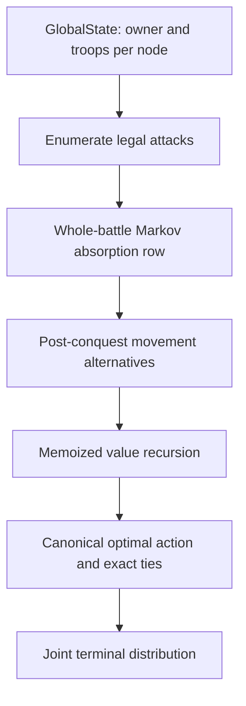
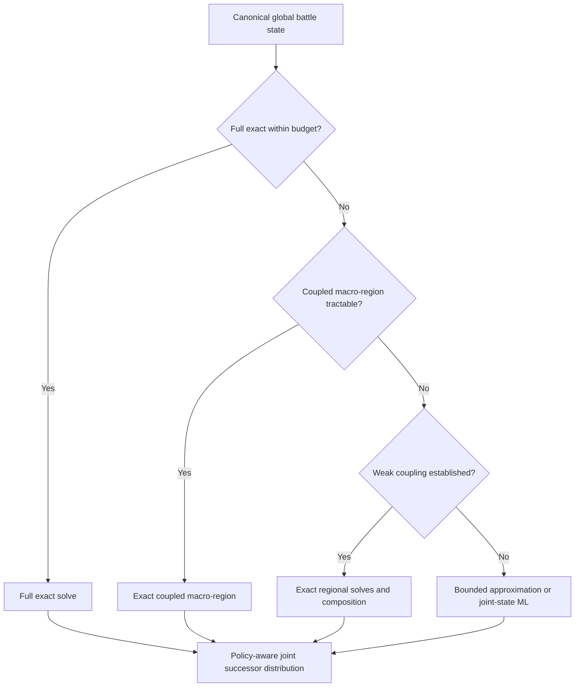

# Architecture and status

## Public exact core

The runnable public path is intentionally narrow:

`markov_matrix_probabilities.py` builds the absorbing combat matrix.
`small_graph_outcome_probabilities.py` defines state, graph, utility,
canonicalization, and reference semantics. `exact_finite_solver.py` packs states
into integers and separates value recursion from terminal-distribution
reconstruction. `exact_policy_dag.py` exports exact tied policy branches.

The local objective is lexicographic:

1. expected newly conquered territories;
2. expected final attacker troops;
3. probability of complete local conquest.

This ordering is a modelling choice, not a universal objective for the full
game.

## Research baseline not copied into the runnable subset

The larger archive contains a production-like regional path: board state to
battle graph, supported exact-cover partitions, precomputed regional library
queries, `state_set` policy candidates, and two-stage Monte Carlo ranking. It
generated important experiments but does not route tractable cases through the
compact exact solver and failed in strongly coupled sequence-opening cases.

The public repository documents this baseline and its results rather than
copying artifact-dependent modules whose execution requires multi-gigabyte
libraries and broader board infrastructure.

## Latest validated target architecture

This router is a research conclusion, not a completed integrated entry point.
As of the retained evidence, production routing had not changed, joint-state
Stage A data had not been regenerated, Stage B had not been retrained, and
multi-turn Stage E validation had not started.

## Policy ties

The canonical solver chooses a stable deterministic action when objective values
tie. The policy-DAG layer can additionally preserve all exact tied actions at
selected depths. That distinction matters because equal objective values do not
guarantee equal terminal distributions. The public example shows the mechanism;
the historical experiment measured the effect over a broader benchmark.
